# ETL 相关内容
ETL（Extract, Transform, Load）开发是指负责开发和维护数据抽取、转换和加载过程的岗位。ETL开发人员通常在数据仓库或数据集成项目中工作，负责处理大量数据，从不同的数据源提取数据，将其转换成适合存储和分析的格式，并加载到目标系统中  
ETL开发人员的主要职责包括：

    数据抽取（Extract）：从多个数据源（如数据库、文件、API等）中提取数据，并确保数据的完整性和准确性。
    数据转换（Transform）：对抽取的数据进行清洗、规范化、转换、计算和整合等处理，以满足业务需求和数据仓库的要求。
    数据加载（Load）：将经过转换的数据加载到目标系统（如数据仓库、数据库、数据湖等）中，通常需要考虑数据质量、性能优化以及数据一致性等方面


### SSIS  和 SSDT 

 SQL server  Integration services 

SQL Server Data Tools (SSDT) 是一款新式开发工具，用于生成 SQL Server 关系数据库、Azure SQL 数据库、Analysis Services (AS) 数据模型、Integration Services (IS) 包和 Reporting Services (RS) 报表。 使用 SSDT，你可以设计和部署任何 SQL Server 内容类型，就像在 Visual Studio 中开发应用程序一样轻松！

在Azure Data Lake中，"原始形式存储"指的是将数据以其初始的、未经过转换或处理的形式进行存储。这意味着数据在被写入Data Lake之前不需要事先定义模式、结构或格式。

传统的关系型数据库通常要求在数据存储之前定义表结构和字段类型，而数据湖的概念则更加灵活，允许将任意格式和类型的数据直接存储到Data Lake中，而无需进行预处理或强制规定特定的结构

```
在Azure Data Lake中，数据湖的底层存储使用了分布式文件系统。具体而言，Azure Data Lake Store（ADLS）基于Azure Blob Storage，它是一种高度可扩展的云存储服务。ADLS提供了高吞吐量和低延迟的存储能力，适用于大规模数据湖场景。

底层的数据存储方式采用了分布式存储架构，将数据划分为较小的块（chunks），并以并行的方式将这些块存储在多个物理设备上。这种分布式存储的方式使得数据可以被同时访问，并且允许对数据进行高效的并行读取和写入操作。

当进行查询时，Azure Data Lake利用元数据服务来管理和索引数据。元数据包含有关数据的信息，如文件结构、位置、大小等。这些元数据使得查询过程更高效，能够快速定位到所需数据的位置。

为了实现快速查询，Azure Data Lake还提供了多种方式来优化数据检索：

    分区：可以根据某个字段对数据进行分区，将数据划分为更小的片段，从而减少需要扫描的数据量。

    索引：可以创建索引来加速特定字段或属性的查询。

    列式存储：可以将数据以列的方式进行存储，从而提高特定字段的访问效率。

    缓存：Azure Data Lake可以使用缓存来存储最常用的数据，以减少查询延迟。

这些技术和优化策略使得在查询数据时，Azure Data Lake能够快速找到并返回所需的数据。同时，由于底层采用了分布式存储架构，还可以通过横向扩展集群规模来提高整体的查询性能和吞吐量

```

###  Apache  Spark

Apache Spark是用于数据分析的最佳数据分析工具之一，用于创建快速的集群计算引擎，以创建并行执行操作的能力。如果没有 Apache Spark，很难在不花费太多时间的情况下运行数据密集型应用程序。
Apache Spark 的一个奇妙特性是它可以小批量处理数据或一次性处理数据。这是 Apache Spark 非常适合迭代处理的原因之一。
为了让事情变得更简单，Apache Spark 指导数据科学家在开发应用程序时应该使用哪些配置。

优点：Apache Spark 的优点是它支持大规模计算和对流数据的快速响应。Apache Spark 以编程库的形式提供接口，这意味着用户可以使用 Java、Scala 或 Python 编写在 30 个节点的集群上执行的程序。
缺点：Apache Spark 最大的缺点是它需要配置才能在您的机器上运行。设置计算节点并不容易，如果你没有正确设置，你真的会搞砸。   


## 学习SSIS 的内容

构建企业级的数据集成 和数据转换，数据清洗挖掘
可以不构建一行代码，创建一个解决方案

目的就是用各种数据源之间提取，转换，和加载数据，以任何你能想到的编程方式更改数据

> 收集和清理来自不用数据来源的数据，并将数据加载到数据仓库等目的地通常非常复杂和繁琐
  intergration Services 使用控制流引擎来管理工作流，数据流引擎来管理数据通道


## Integreation  Service  包括的内容

* 用于生成和调试包的图形工具和向导
* 执行工作流功能，如FTP操作，执行SQL 语句和发送电子邮件
* 提取和加载数据的源和目标，如处理文件，复制数据库对象等
* 用于清理,聚合，合并，复制数据库的转换
* 一个管理包执行和存储的数据库
* 用于对Integration Service 对象模型编程的应用程序编程接口（APIs）

SSIS 集成服务听起来高大上，但实际上就是 导入导出,最常用的维护计划任务，也是SSIS包


## SSIS 体系和功能结构

SSIS 的体系结构主要由四部分组成：
1. Integration  Services 服务
2. Integration  Services 的对象模型
3. Integration Services 运行时（环境）
4. 运行时可执行文件以及封装数据流引擎和数据流组件的数据流任务


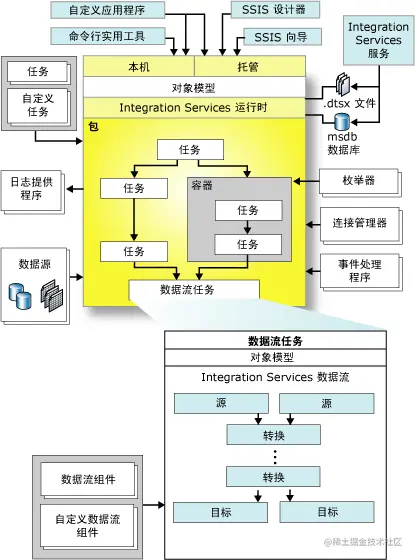
> WebP是一种图像文件格式，由Google开发并于2010年发布.WebP格式采用了先进的压缩算法，可以实现比传统的JPEG和PNG格式更小的文件大小，同时保持较高的图像质量

* **[数据库管理]**   
有时需要转移数据。导入导出向导可以用来在Excel、SQL Server表、平面文件和ODBC连接等之间迁移数据，它允许表或查询级别的数据转移，
从而使DBA可以扩展在迁移数据时，对数据进行聚合和转换的能力

* **[商业智能]**

在商业智能中，数据集成工具的主要用途是数据的提取、转换和加载（ETL）操作。SSIS的核心是数据流任务(Data Flow Task)，它的设计理念形象地描述为"流水线结构"，数据流任务是一个强大且灵活的数据泵。
* **[使用与设计模式]**   
SSIS中 一个最受还原的加载设计模式是 "增量加载"。借助于此，仅仅新的或更新的数据会从源移动到目标表单，实现增量加载的一个主要方法是：  读取源数据 ， 与目标关联  ，过滤新数据，写入目标

* **[职责分离]**
不像DTS和其他数据迁移产品，SSIS分离工作流和数据流的操作。控制流以同步方式管理工作流；按顺序完成每个任务后，再转到下一个任务。
在控制流中，并发的实现是通过创建多个执行路径（path）。数据流（Data Flow）获取、转换、加载"大块"数据；一次一个缓冲区。在数据流操作期间的任何时刻，都可能存在未读入数据流管道的行、正被数据流组件进行转换处理的行、已经处理和加载到目标中的行


* **SSIS包通俗来说，就是一个完整的完成某项数据处理任务的程序，包文件.dtsx采用XML格式**
> A package in SSIS is an organized collection of connections like data flow elements, control events, event handlers, parameters, variables, and configurations. You assemble them either building it programmatically or by graphical design tools that SSIS provides

## SSDT 的使用

> SSIS的包开发和管理工具包括：SQL Server Data Tools (SSDT)(用于开发集成服务包)、SQL Server Management Studio(用于生产环境中管理包)
SQL Server Data Tools已经集成到 Visual Studio 中进行SSIS包的开发。  
从 Visual Studio 2019 开始，不再提供SSDT独立安装版本。

>  SSDT 的前身是 Business Intelligence Development Studio(BIDS)

SSIS 应用场景

SSIS 应用主要是在一些商业智能的大型数据系统中，对数据的抽取，清洗等，以获得高质量的数据，是企业
在做分析的时候分析出准确的结果。同时SSIS也会应用于日常的数据管理中，比如一些DBA对数据库的管理，
对数据库Job的管理，对数据库的迁移，合并等工作。


## 操作方法：
#### 1.下载安装Visualstudio  
#### 2. 安装SSIS project
[下载链接点击](https://marketplace.visualstudio.com/items?itemName=SSIS.MicrosoftDataToolsIntegrationServices)

下载之后安装这个插件

####  3. 项目的创建
3.1.开启VS 进行项目的创建   

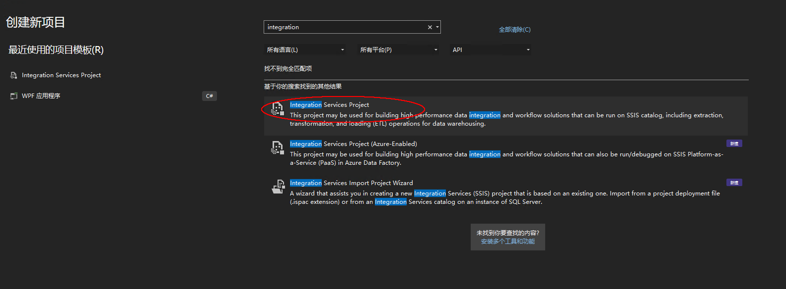
3.2 创建连接管理

3.2 创建工作流

3.3 创建SSIS包

### 4. 增量的加载(  Incremental Load)
本质上，增量加载是可以重新执行的，这意味着可以一遍一遍地执行加载器而不会造成损伤


### 5. 数据仓库(Data Warehouse)

### 6. 数据集成(Data Integration)

### 7. 数据迁移(Data Migration)

### 8. 数据转换(Data Conversion)

### 9. 数据清洗(Data Cleaning)


## PDI 工具的使用
### 工具介绍
>参考资料 http://www.5180it.com/f/article/121920.html
Kettle是一个Java编写的ETL工具，主作者是Matt Casters，2003年就开始了这个项目，目前最新稳定版为9.4。9.2以后依赖 JDK11+

2005年12月，Kettle从2.1版本开始进入了开源领域，一直到4.1版本遵守LGPL协议，从4.2版本开始遵守Apache Licence 2.0协议。
1. Chef 工作job设计工具（GUI 方式）
2. Kitchen 工作job执行器 （命令行）
3. Spoon  转换（transform）设计工具（GUI 方式）
4. Span 转换执行器 （命令方式）


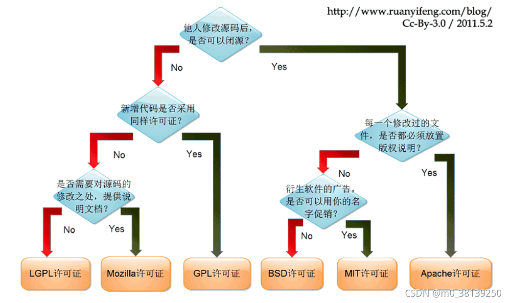    
  


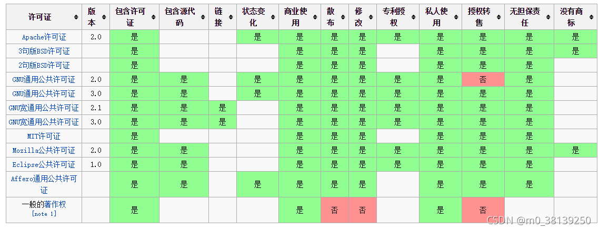  


为什么标题为PDI(Kettle)简介与安装呢，这是因为 Kettle在2006年初加入了开源的BI公司Pentaho, 正式命名为：Pentaho Data Integeration，简称“PDI”。 自2017年9月20日起，Pentaho已经被合并于日立集团下的新公司： Hitachi Vantara。

Kettle可以简化数据仓库的创建，更新和维护，使用Kettle可以构建一套开源的ETL解决方案！

### 1.下载和安装JDK 的环境

1.JDK(Java Development Kit)

Java程序开发工具包，包含JRE和开发人员使用的工具。其中的开发工具：编译工具 （javac.exe）和运行工具（java.exe）。如果想开发一个全新的Java程序，必须安装JDK
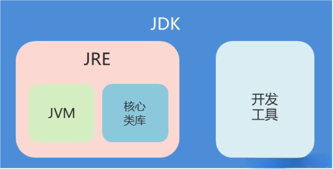

[下载路径](https://www.azul.com/downloads/?version=java-11-lts&package=jdk#zulu)

>Azul 的JDK 下载的时候不需要登录账户，且是优化过的，使用简单

1.2 设置环境变量
  


### 2.启动PDI的软件

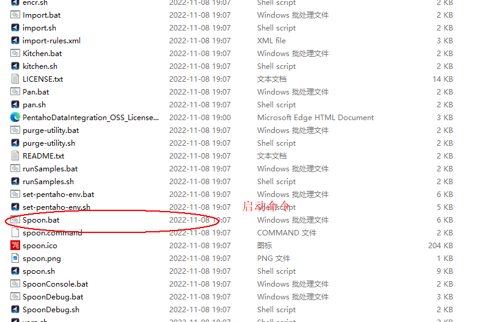

PDI 的核心知识点：

* 两种的设计模式


* 

作业是步骤流（一般为串行），转换是数据流（并行）
作业的每一个步骤，必须等到前面的步骤都跑完了，后面的步骤才会执行；而转换会一次性把所有的控件全部启动（一个控件对应启动一个线程），然后数据流会从第一个控件开始，一条记录，一条记录的流向最后的控件

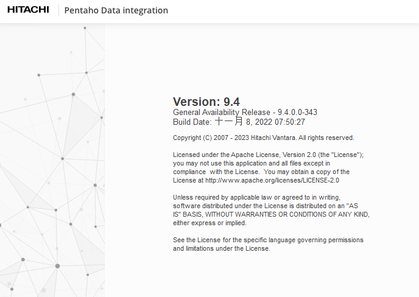

#### 配置数据库连接的时候，报错了
> 该主机内容没有mss sql的 jdbc 驱动


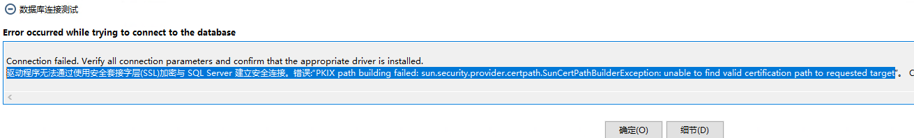  

需要手动下载JDBC的驱动


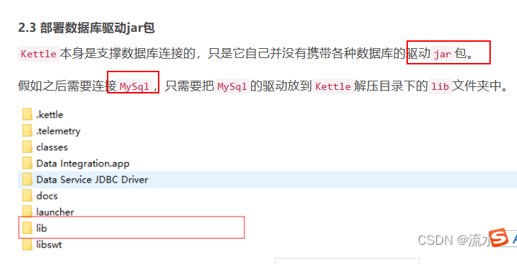  

[各种数据库驱动下载链接](https://mvnrepository.com/)
找到对应版本的驱动，下载它，确认一下没有漏洞的

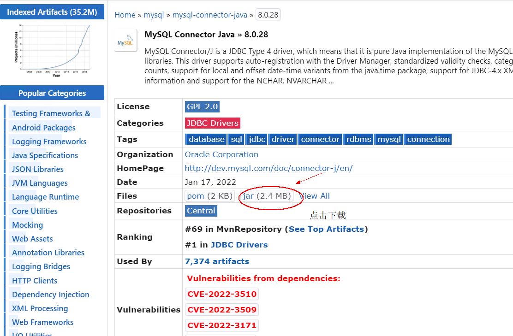  

使用账号密码连接


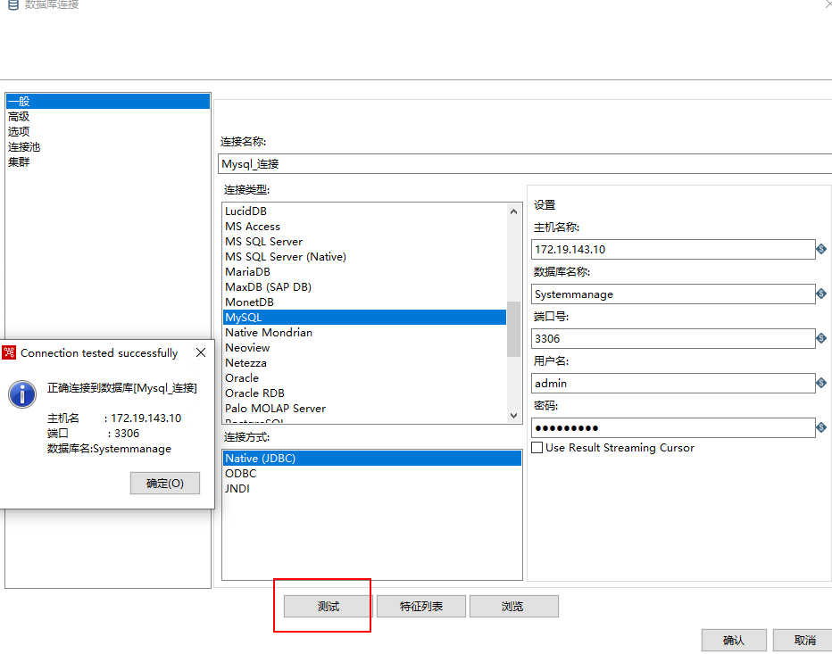  

SHOW VARIABLES LIKE '%ssl%';


#### 连接MSSQL 数据库时候报错误
  
解决方法：将mssql-jdbc_auth-12.4.2.x64.dll 这个文件放到JRE的工作目录中    


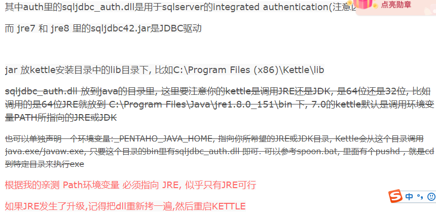
接着连接就可以了

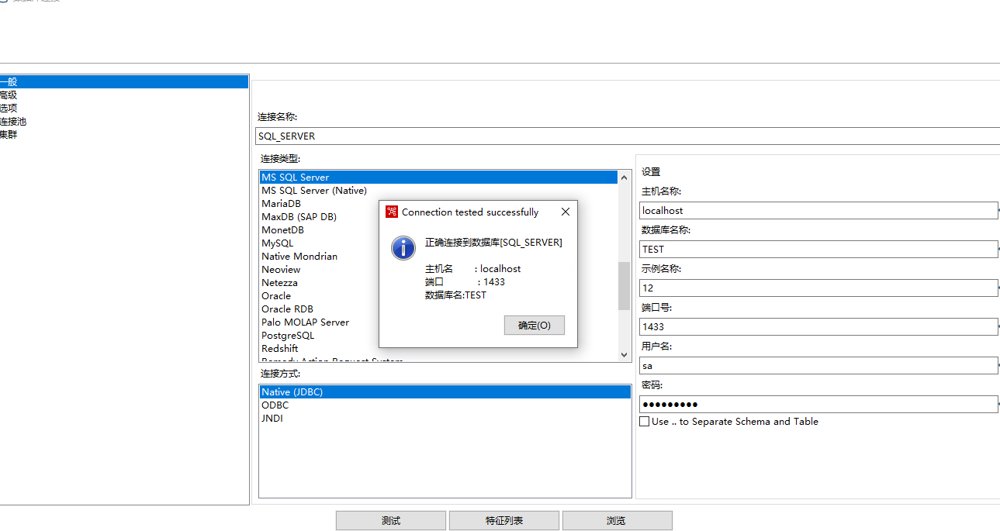 

文件扩展名：

kjb: job，作业

ktr: transformation，转换

作业可以包裹多个转换和作业

强烈建议：不要直接执行转换，用一个作业来包裹转换，执行作业，以便统一管理。
```
1. 打开Kettle，点击"新建" -> "转换"。
2. 在左侧的"设计"面板中，找到"输入" -> "表输入"，将其拖到中间的画布上。
3. 双击"表输入"，在弹出的窗口中，选择你的数据库连接，然后在"SQL"框中输入TRUNCATE TABLE your_table_name;，点击"确定"。
4. 在左侧的"设计"面板中，找到"输入" -> "获取文件名"，将其拖到画布上，并与"表输入"步骤连接。
5. 双击"获取文件名"，在弹出的窗口中，指定你的文件目录和文件类型（.csv），点击"确定"。
6. 在左侧的"设计"面板中，找到"输入" -> "CSV文件输入"，将其拖到画布上，并与"获取文件名"步骤连接。
7. 双击"CSV文件输入"，在弹出的窗口中，指定你的CSV文件的格式和内容，点击"确定"。
8. 在左侧的"设计"面板中，找到"输出" -> "表输出"，将其拖到画布上，并与"CSV文件输入"步骤连接。
9. 双击"表输出"，在弹出的窗口中，选择你的数据库连接和表名，点击"确定"。
10. 在左侧的"设计"面板中，找到"工具" -> "复制文件"，将其拖到画布上，并与"表输出"步骤连接。
11. 双击"复制文件"，在弹出的窗口中，指定源文件和目标文件的目录，选择添加时间戳到文件名，点击"确定"。
12. 点击"保存"，保存你的转换。
13. 点击"运行"，运行你的转换。

```

#### 文件类型筛选，使用文件正则表达式


>Linux下如何安装JDK的版本

sudo yum install epel-release   安装拓展软件源，允许系统从其他非官方源安装软件

sudo yum install screen  

 sudo yum install java-11-openjdk-devel    安装JDK 的版本
1. 启动一个新的会话     screen -S kettle
2.  ./carte.sh localhost 8080    

通过web 界面查询执行清理


### Linux 通过命令行运行PDI 的job，
使用工具如 screen 或 tmux 创建一个会话，在该会话中运行作业。这些工具可以让你创建一个持久的终端会话，即使在关闭命令窗口后，会话仍然保持运行。你可以在会话中运行 Kettle 作业并将其保持活动状态

```
screen  -ls  显示所有的会话
screen -X -S 26552 quit  停掉指定的会话


```

kettle 的使用场景
参考资料： https://www.cnblogs.com/lydg/p/17647939.html

1. 编写kettle.bat 脚本文件
1. 增量同步

2. 分组

3. 字符串操作

4. 字符串替换
5. 替换NUll 值
6. 去除重复的记录
7. 获取系统信息
8. 生成随机数
9. 读取指定行的Excel
10. 导入文件夹下的多个文件
