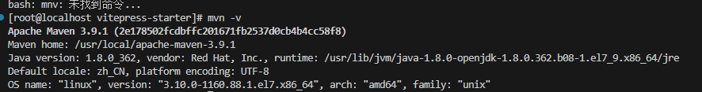
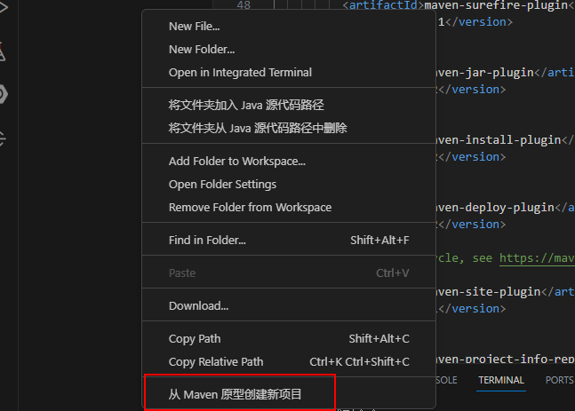

## 工具和框架方面 

###  Maven 是啥？有啥用

` Maven是一个Java项目管理工具，它可以帮助你自动化构建、测试和部署Java项目。Maven使用一个中央仓库来管理项目依赖关系，并提供了一组标准化的构建生命周期阶段，使得构建过程更加简单和可重复。Maven还可以生成项目文档和报告，并支持多模块项目的构建。`

如果你想使用Maven来构建你的Java项目，你需要在你的项目中添加一个pom.xml文件，该文件描述了项目的依赖关系、构建配置和其他相关信息。你可以使用Maven命令来执行各种构建任务，例如编译代码、运行测试、打包应用程序等等！！总之，Maven是一个非常有用的工具，可以帮助Java程序员更加高效地管理和构建他们的项目


###  Maven 常使用命令

maven 命令除了常用的几个，大部分经常记不住，整理一下，方便查询。

maven 命令的格式为 mvn [plugin-name]:[goal-name]，可以接受的参数如下。

-D 指定参数，如 -Dmaven.test.skip=true 跳过单元测试；

-P 指定 Profile 配置，可以用于区分环境；

-e 显示maven运行出错的信息；

-o 离线执行命令,即不去远程仓库更新包；

-X 显示maven允许的debug信息；

-U 强制去远程更新snapshot的插件或依赖，默认每天只更新一次。
常用maven命令

    创建maven项目：mvn archetype:create

    指定 group： -DgroupId=packageName

    指定 artifact：-DartifactId=projectName

    创建web项目：-DarchetypeArtifactId=maven-archetype-webapp

    创建maven项目：mvn archetype:generate

    验证项目是否正确：mvn validate

    maven 打包：mvn package

    只打jar包：mvn jar:jar

    生成源码jar包：mvn source:jar

    产生应用需要的任何额外的源代码：mvn generate-sources

    编译源代码： mvn compile

    编译测试代码：mvn test-compile

    运行测试：mvn test

    运行检查：mvn verify

    清理maven项目：mvn clean

    生成eclipse项目：mvn eclipse:eclipse

    清理eclipse配置：mvn eclipse:clean

    生成idea项目：mvn idea:idea

    安装项目到本地仓库：mvn install

    发布项目到远程仓库：mvn:deploy

    在集成测试可以运行的环境中处理和发布包：mvn integration-test

    显示maven依赖树：mvn dependency:tree

    显示maven依赖列表：mvn dependency:list

    下载依赖包的源码：mvn dependency:sources

    安装本地jar到本地仓库：mvn install:install-file -DgroupId=packageName -DartifactId=projectName -Dversion=version -Dpackaging=jar -Dfile=path

web项目相关命令

    启动tomcat：mvn tomcat:run

    启动jetty：mvn jetty:run

    运行打包部署：mvn tomcat:deploy

    撤销部署：mvn tomcat:undeploy

    启动web应用：mvn tomcat:start

    停止web应用：mvn tomcat:stop

    重新部署：mvn tomcat:redeploy

    部署展开的war文件：mvn war:exploded tomcat:exploded

### YAML 
为配置文件，YAML应该是对人眼读取和编辑最友好的了，当然扩展性呢，就比JSON差了点，更不如XML，不过有舍有得么，一般情况下够用了   
`YAML 是一种人类可读的数据序列化语言，通常用于编写配置文件。业界对 YAML 有不同的看法，有人会说 YAML 不过代表了另一种标记语言，另外一些人认为“YAML ain’t markup language”（“YAML 不是标记语言”），“YAML” 正是这句话的首字母缩写，强调了 YAML 是用于数据而不是文档`。

YAML 是一种流行的编程语言，因为它的设计人类可读，易于理解。它还可以与其他编程语言结合使用。由于 YAML 的灵活性和可访问性，Ansible 自动化工具使用它以 Ansible Playbook 的形式创建自动化流程。   
### 缺点
当然这世上没有银弹，YAML也有它固有的缺点。

首先开头提到过，它的扩展性差——这一点上XML优势明显，它每个标签有attribute，可以任意定义“元数据”，比如示例中的datatype，这是YAML和JSON的共同弱项；如果实在需要，就只能把元数据也放在数据项中，然后用特殊的字符前缀来标识（类似Python对象中的__dict__）
其次它对格式要求很严格，没法以“紧凑”形式表达：比如不需要人读的时候，我们可以把JSON串压缩在一行，尽可能去除所有空格，这个YAML显然做不到。
还有就是各种语言中，对YAML的支持都还不够成熟，尤其是序列化/反序列化部分，现有的库都很不方便。   

### 结论
如果没有强烈的第三方扩展性需求，YAML是配置文件的最佳选项。当然，为此付出的代价，就是一开始需要手写一点点序列化/反序列化代码。

## 使用VScode 创建和运行java  maven的项目

### 1.安装maven,完成后确认安装的版本


### 2.安装JAVA相关插件

通过Java Extension Pack为VS CODE安装这些插件：

    Language Support for Java(TM) by Red Hat
    Debugger for Java
    Java Test Runner
    Maven for Java
    Java Dependency Viewer
### 3.vscode空白处点击右键选择【从maven原型创建新项目】


### 4.创建项目窗口中可以选择快速创建项目,选择版本
### 5.填写项目的组织，一般是公司域名的倒写
> Maven的基本工作单元POM（Project Object Model）项目对象模型

## maven 的事业

### 查询maven的本地仓库的路
```
mvn help:effective-settings
```