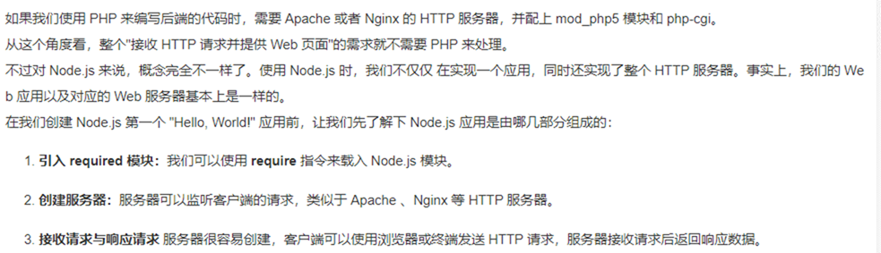
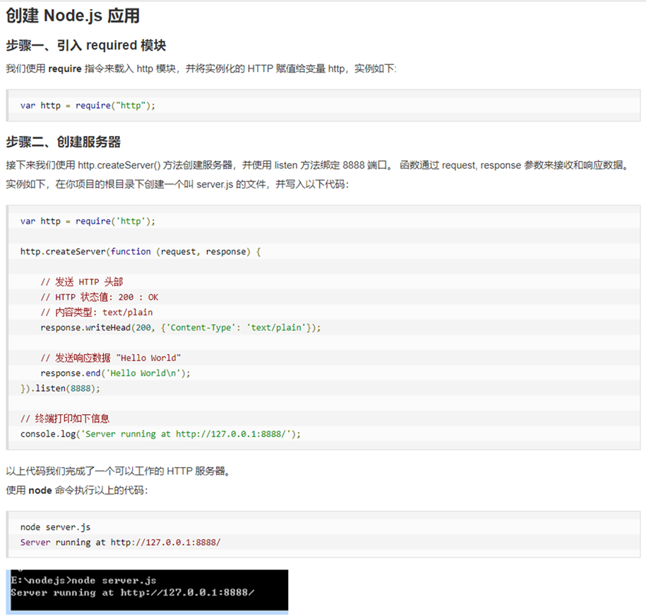

## node 的相关操作

###  node  JS  是什么？

     JavaScript 诞生于 1995 年，几乎是和互联网同时出现；Node.js 诞生于 2009 年，比 JavaScript 晚了 15 年左右。

在 Node.js 之前，JavaScript 只能运行在浏览器中，作为网页脚本使用，为网页添加一些特效，或者和服务器进行通信。有了 Node.js 以后，JavaScript 就可以脱离浏览器，像其它编程语言一样直接在计算机上使用，想干什么就干什么，再也不受浏览器的限制了。

Node.js 不是一门新的编程语言，也不是一个 JavaScript 框架，它是一套 JavaScript 运行环境，用来支持 JavaScript 代码的执行。用编程术语来讲，Node.js 是一个 JavaScript 运行时（Runtime）

   

   

### node 的工具

#### 3.1 PM2是node进程管理工具，可以利用它来简化很多node应用管理的繁琐任务，如性能监控、自动重启、负载均衡等，而且使用非常简单。												
`npm install -g pm2		全局安装pm2	`

#### 3.2 启动的时候带入名字
` pm2 start app.js  --name  tetApi	`		
