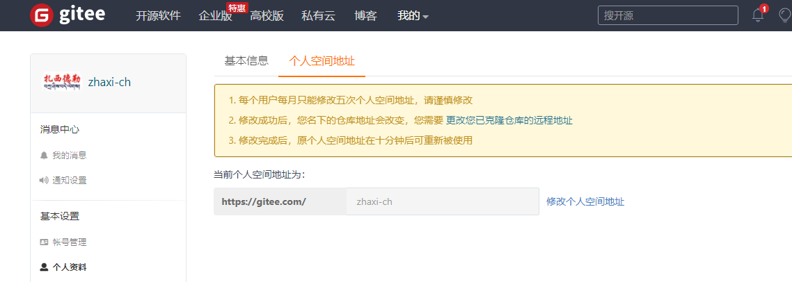
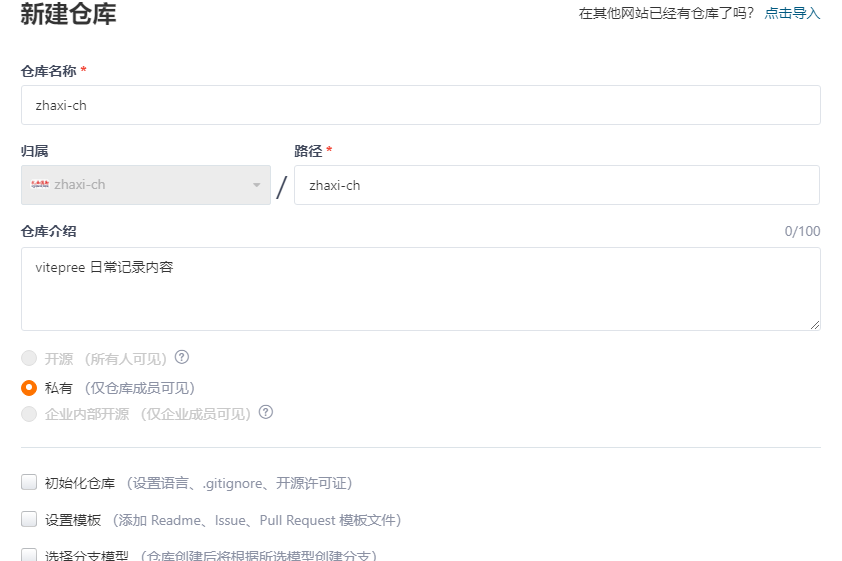
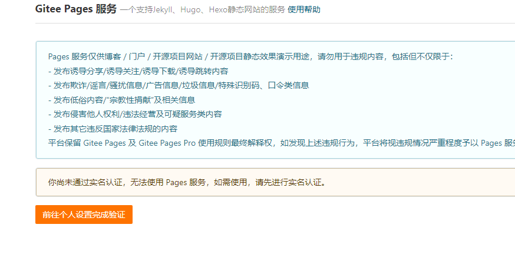

# 免费部属到Gitee(zhaxi's blog)
`Gitee Pages` 是一个免费的静态网页托管服务

`Gitee Pages `托管博客、项目官网等静态网页

`Gitee Pages` 支持 Jekyll、Hugo、Hexo编译静态资源(Jekyll、Hugo、Hexo 是简单的博客形态的静态站点生产机器)。
## 1.新建一个与你的账号同名的仓库
::: tip 如何创建一个首页访问地址不带二级目录的 pages，如ipvb.gitee.io？
如果你想你的 pages 首页访问地址不带二级目录，如ipvb.gitee.io，你需要建立一个与自己个性地址同名的仓库，如 https://gitee.com/ipvb 这个用户，想要创建一个自己的站点，但不想以子目录的方式访问，想以ipvb.gitee.io直接访问，那么他就可以创建一个名字为ipvb的仓库 https://gitee.com/ipvb/ipvb 部署完成后，就可以以 https://ipvb.gitee.io 进行访问了
:::
## 2.准备基础的内容
### 2.1 先查询自己的仓库地址

## 2.1 创建一个同名的仓库

## 2.3 要实名认证,上传身份证,姓名等等操作,再试试github
