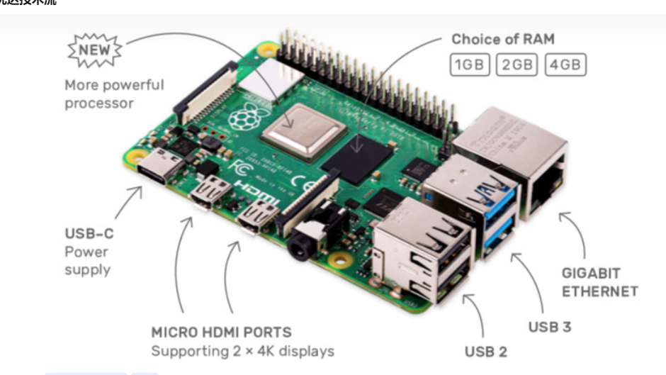
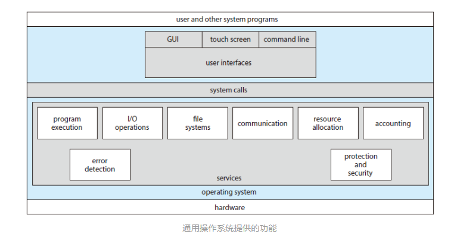
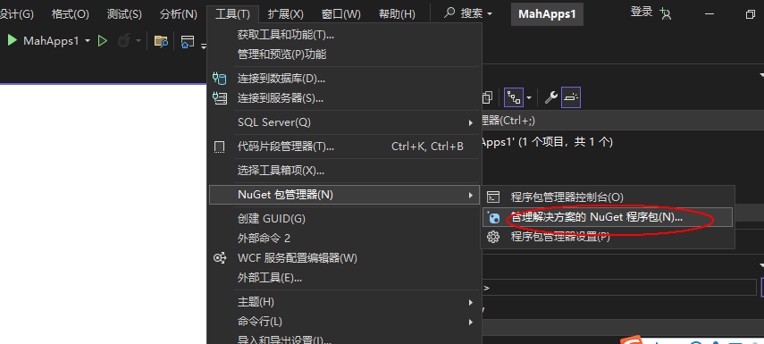
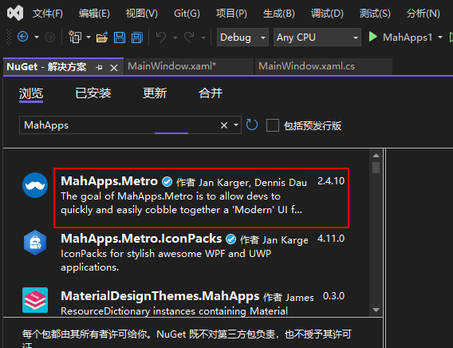
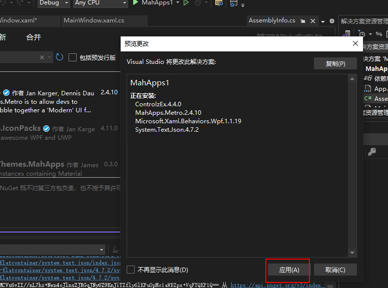
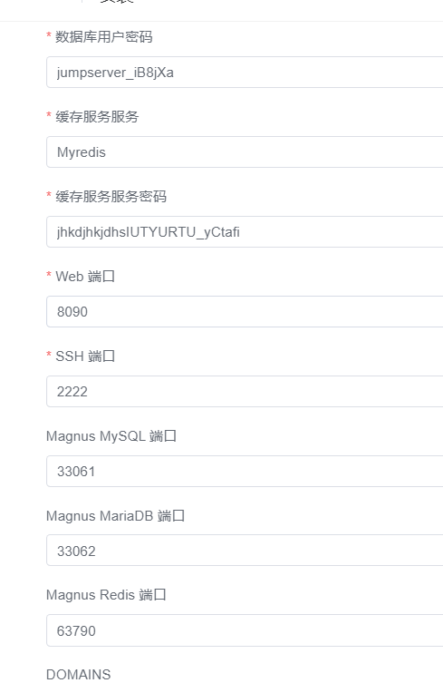

## 随笔日记记录
> 根据时间内容随时记录看到和学习到的一些知识和内容


## 2023年11月11日   星期六

### Devops 的概念和理解
DevOps是一种软件开发和IT运维的实践方法，旨在通过加强开发团队与运维团队之间的协作与沟通，实现软件应用的快速交付、高质量和可靠性。
DevOps包含以下几个主要方面：

1. 自动化：自动化是DevOps的核心原则之一。它涉及使用工具和脚本来自动执行软件开发和部署过程，从而提高效率、降低错误和减少重复工作。

2. 持续集成和持续交付（CI/CD）：CI/CD是DevOps的关键实践，旨在将代码频繁集成到共享存储库中，并自动构建、测试和部署软件。这样可以快速检测和解决问题，缩短交付时间，并提高产品质量。

3.  配置管理：配置管理涉及对软件环境进行版本控制和自动化管理。通过使用工具如Ansible、Chef或Puppet，可以确保各个环境的一致性，并能够快速复制和部署环境。

4.  容器化和容器编排：容器化技术（如Docker）使得应用程序更易于部署、管理和扩展。容器编排工具（如Kubernetes）帮助管理大规模容器化应用程序的自动化部署和管理。

5.  监控和日志管理：DevOps需要建立有效的监控和日志管理系统，以便实时跟踪应用程序的性能、健康状况和异常情况。这些信息对于快速定位和解决问题至关重要。
### IPD产品开发
IPD指的是"产品开发流程"（或"产品开发过程"）, 是指将一个新产品从概念到实际推向市场的整个过程。它涉及到研究、设计、制造、测试和推广等一系列步骤
IPD的全称是“Integrated Project Delivery”，即集成产品开发

1. 开源软件：

    Odoo（原名OpenERP）：它是一个全功能的企业资源规划（ERP）软件。Odoo提供了各种模块，包括项目管理、任务管理、采购管理等，可以用来支持企业的IPD流程。

    Redmine：这是一个灵活且易于使用的项目管理工具。它提供了任务跟踪、问题追踪、版本控制等功能，适合用于IPD流程中的项目管理。

    Tuleap：它是一个开源的协作平台，专注于软件开发和项目管理。Tuleap提供了项目追踪、需求管理、文档管理等功能，非常适合IPD流程的实施。

2. 商业软件系统：

    Microsoft Project：这是一款功能强大的项目管理软件，广泛应用于企业IPD流程。它提供了进度计划、资源分配、成本管理等功能，并具有良好的可视化和报告功能。

    Oracle Primavera：这是一套专业的项目和端到端解决方案，适用于复杂的工程和建筑项目。它提供了项目规划、风险管理、资源管理等功能，非常适合大型企业的IPD流程。

    Jira：这是一款广泛使用的敏捷项目管理工具，适用于软件开发和IT团队。Jira提供了任务追踪、缺陷管理、故事板等功能，可以支持敏捷IPD流程的实施。
## 自动化运维和DEvops 的理解  
   目的是加强Dev  和OPS 之间的沟通和协助，部署和运维全程自动化进行
* Kubernnetes 的认识和实际使用
  k8s 是开源的容器编排平台。主要用于自动化应用程序的部署和管理。主要组件有 Master 节点和worker 节点
  Master节点负责资源调度和管理，

* 300多台服务器，如何进行管理 ？
  堡垒机，ansible 
* LVS  nginx,Haproxy  有啥区别
LVs ： 是基于四层转发的 （linux virtual  server)
HAProxy ： 是基于四层和七层转发的。专业的代理服务器
Ngixn： 是web和缓存服务器，可以做七层的转发

## 2023年11月13日   星期一

### Deeplearning 深度学习

### **机器学习（内容）**
>  机器学习是一种人工智能的领域，其目的是通过让计算机系统从数据中学习和改进，以实现特定任务的自动化。与传统的编程方式不同，机器学   习模型可以从大量的数据中提取模式和规律，并使用这些模式进行预测、决策或执行特定任务。
```
机器之所以可以自我学习，是因为机器学习模型具备了学习能力的算法和结构。
这些模型可以根据输入的数据进行自我调整和改进，以提高其在特定任务上的性能。
通过不断地暴露给模型更多的数据和反馈，它可以逐步优化自己的表现，并提供更准确的输出结果。
这种自我学习的能力使得机器能够处理复杂的问题，并且在面对新的情况时具备适应性和智能化的能力

```
<!-- 读文章 -->
### **(技术文章)**
来自微信公众号 民工哥技术之路  
文章名字   还是决定去华为了
  重要内容摘要
*  入职薪酬
*  长期预期薪酬
*   offer 在同龄人中的相对档次
*  业务匹配度
*  成长空间
*  工业界的影响力
*  学术界的影响力
*  Work-life  balance 
*  领导熟悉度
*  工作稳定程度
*  公司文化
*  公司品牌
*  部门前景
*  技术积累
*  大牛老板

## 2023年11月15日   星期三
**Mysql基本的问题**

1. char varchar 的区别？


对于经常需要变化的数据来说，CHAR 比 varchar  更好，

2. TRUNCAT 和 delete 的区别
Delect 是从表中删除指定的一行
Trucat  是永久性的删除某一行

3. 触发器是啥？ 都有啥


4. Float 和double 的区别是啥 


5. 


## 2023年11月16日   星期四   

### Redis 的内容


## 2023年11月16日   星期四   

ETL (SSIS,kETTLE)  Extract Transform  Load  
提取，转换，加载
ETL 的主要目标是将异构的数据源整合为一致的，可分析的数据集，支持业务决策，报表生成，数据分析等


## 2023年11月18日  星期六   

###  常用的嵌入式开发平台有以下几种：


    Arduino：Arduino是一种简单易用的开源电子原型平台，适用于初学者和专业人士。它提供了一个方便的开发环境和丰富的库函数，支持多种硬件扩展板，如传感器、执行器等。

    Raspberry Pi：Raspberry Pi是一款小型的低成本计算机板，具有强大的处理能力和丰富的接口。它可以运行Linux操作系统，并支持多种编程语言，如Python、C/C++等。

    STM32：STM32(意法半导体）系列是STMicroelectronics推出的一款基于ARM Cortex-M内核的32位微控制器。它具有高性能、低功耗、丰富的外设和广泛的开发工具支持，适用于各种嵌入式应用领域。

    ESP8266/ESP32：ESP8266和ESP32是乐鑫科技推出的一款集成Wi-Fi功能的芯片，可用于构建物联网设备。它们具有小巧的体积、低功耗和丰富的通信接口，适合于无线通信和物联网项目的开发。

    BeagleBone：BeagleBone是一款基于ARM架构的开发板，具有丰富的接口和强大的处理能力。它支持多种操作系统，如Linux和Android，适合于构建复杂的嵌入式系统。


ESP8266/ESP32  是基于tensilica 处理器架构  

```
Arduino官方网站：提供了丰富的实验指南、示例代码和教程，适合初学者入门。
[Raspberry Pi官方网站](https://www.raspb)

```
乐鑫科技 的开发板是国内做的，

MCU代表微控制器单元（Microcontroller Unit），是一种集成了中央处理器（CPU）、内存和输入/输出接口等功能的小型计算机系统   
串口通信和I2C/SPI总线是常用的数据通信协议  

::: warning
串口通信：使用通信端口（例如RS-232）来发送和接收数据。发送方将数据转换为电平信号，并通过物理线连接到接收方。接收方解析电平信号并还原数据。

I2C总线：使用两根线（SDA和SCL）进行串行传输。发送方将数据放置在SDA线上，并通过SCL线发送时钟信号。接收方在特定时钟边沿读取数据。

SPI总线：使用多个线（主时钟线、主片选线、MISO、MOSI）进行全双工传输  
:::

单片机就是 MCU    

###  I2C总线详解

> I2C总线是一种常用的通信接口 
 I2C总线是由Philips公司开发的一种简单、双向二线制同步串行总线。它只需要两根线即可在连接于总线上的器件之间传送信息

I2C具有如下特点：

①只需要两条总线；串行数据线(SDA)和串行时钟线(SCL)。

②连接到总线的每个设备都是可通过唯一地址进行软件寻址的，并且始终存在简单的控制器/目标关系；控制器可以作为控制器发送器或控制器接收器运行。

③这是一种真正的多控制器总线，包括冲突检测和仲裁，以防止两个或更多控制器同时启动数据传输时出现数据损坏。

④面向8位的串行双向数据传输速率在标准模式下最高可达100 kbit/s，在快速模式下最高可达400 kbit/s，在快速增强模式下最高可达1 Mbit/s，在高速模式下最高可达3.4 Mbit/s。

⑤串行、面向8位、单向数据传输，在超快速模式下最高可达5 Mbit/s。

⑥片内滤波可抑制总线数据线上的尖峰信号，以保持数据完整性。

⑦可以连接到同一总线的IC数量仅受最大总线电容的限制。在某些条件下（如简化SCL时钟频率、增加输出驱动力、增加缓冲器件、改进上拉电阻等），可以允许更大的电容。

⑧极低的电流消耗，高抗扰度，宽电源电压范围，宽工作温度范围。

⑨硬件的最简化，给芯片设计师减轻了节省输出引脚的压力，给芯片应用商带来了成本降低、空间减小、测试方便、易于升级等诸多好处，为芯片应用工程师的产品开发带来灵活多样的选择方案、方便快捷的调试手段、开发周期的缩短、开发效率的提高等好处。

### Raspberry pi



## 2023年11月20日  星期一
无内容

## 2023年11月21日  星期二

RTOS（实时操作系统）Real-Time Operating System   [！FreeRTOS](https://www.freertos.org/)

>Nuttx是使用C和C++语言开发的。它是一个基于实时操作系统（RTOS）的嵌入式操作系统，专为资源受限的系统设计。Nuttx的代码主要由C语言编写，但也可以使用C++进行开发

日常可以使用的RTOS包括FreeRTOS、UCOS、RT-Thread等
* FreeRTOS 的描述
FreeRTOS及其在意法半导体STM32平台，乐鑫科技ESP32平台和Arduino平台上的开发与运用。

可实现：任务管理、时间管理、信号量、消息队列、内存管理、记录功能 
>FreeRTOS 是一个可裁剪、可剥夺型的多任务内核，而且没有任务数限制。FreeRTOS 提供了实时操作系统所需的所有功能，包括资源管理、同步、任务通信等。
FreeRTOS 是用 C 和汇编来写的，其中绝大部分都是用 C 语言编写的，只有极少数的与处理器密切相关的部分代码才是用汇编写的，FreeRTOS 结构简洁，可读性很强！最主要的是非常适合初次接触嵌入式实时操作系统学生、嵌入式系统开发人员和爱好者学习。
最新版本 V9.0.0（2016年），尽管现在 FreeRTOS 的版本已经更新到 V10.4.1 了，但是我们还是选择 V9.0.0，因为内核很稳定，并且网上资料很多，因为 V10.0.0 版本之后是亚马逊收购了FreeRTOS之后才出来的版本，主要添加了一些云端组件，一般采用 V9.0.0 版本足以.   



## 2023年11月23日  星期四

Linux 内核原理指的是Linux操作系统的核心组件，它是操作系统的基础，负责管理计算机的硬件资源，并提供了各种系统服务和功能。Linux内核被设计为开放源代码，因此任何人都可以查看、修改和扩展它。

Linux内核原理涵盖了以下几个关键概念：

    进程管理：Linux内核负责创建、调度和管理进程（程序的执行实例），包括分配资源、上下文切换和进程间通信等。
    内存管理：内核跟踪和管理计算机的物理内存和虚拟内存，包括内存分页、页面置换和内存保护等。
    文件系统：内核提供文件系统接口，用于管理文件和目录，包括文件权限、访问控制和磁盘空间分配等。
    设备驱动程序：内核提供设备驱动程序接口，使应用程序能够访问计算机的硬件设备，如磁盘驱动器、网络接口卡等。
    网络协议栈：内核实现了各种网络协议，如TCP/IP协议族，用于实现网络通信和互联网连接

## 2023年11月24日  星期五

Windows Presentation Foundation (WPF) 

>Qt 是一个跨平台的开发框架，可以用于构建各种类型的应用程序，包括图形用户界面（GUI）应用程序。Qt 在开源社区中以 LGPL 许可证发布，这意味着你可以自由地使用 Qt 框架来开发软件，而不需要支付版权费用。


## 2023年11月27日  星期一
学习一下Winform 和 WPF 的区别

>**WINform Windows Forms**是一种基于传统Win32 API的技术，使用C#或VB.NET语言进行开发。它提供了一组用于创建用户界面的控件，如按钮、文本框、标签等。WINform使用事件驱动模型，在代码中处理用户交互，并且可与其他技术（如ADO.NET）结合使用。

>**WPF（Windows Presentation Foundation**是一种更现代化、更强大的UI框架，也是使用C#或VB.NET进行开发。它采用XAML（可扩展应用程序标记语言）来描述用户界面，将界面和逻辑分离，使开发人员可以更灵活地设计应用程序的外观和行为。WPF还提供了强大的数据绑定、样式和动画功能，以及易于定制和扩展的控件模型。 

XAML （ extensible  appliction Markup Lanague) 可拓展应用程序标记语言

### WPF 的文件结构
1. MainWindow.xaml 文件是WPF 应用程序的主窗口，它包含了应用程序的用户界面，
2. APP.xaml 是WPF 应用程序级别资源文件，它可以定义应用程序范围内的资源，如样式，模板，转换等

### Mahapps.Metro 框架的使用

>来自德国公司开源的UI框架，专为WPF（Windows Presentation Foundation）应用程序设计。该框架提供了丰富的现代化UI控件和主题样式，旨在帮助开发人员快速构建具有吸引力和一致性的用户界面。

**创建第一Mahapps的程序**   

1. 安装MahApps.Metro 
  首先创建一个WPF 项目，然后使用NUget来安装MahApps.Metro 的程序包

  
2. 引用MahApps.metro 的命令空间   

>namespace 是一种组织和管理代码的机制，它提供了一种将相关类，接口，结构和其他类型组织在一起的方式，以避免命名冲突
点击工具--NUGet包管理器---管理解决方案的NU固态程序包
  

3. 在线搜索下载这个Mahapps的包   

 


4. 使用MahApps.Metro的控件
* 引用MahApps的命名空间
在XAML文件中，添加对MahApps.Metro命名空间的引用。例如，在Window标签中添加xmlns:metro="clr-namespace:MahApps.Metro.Controls;assembly=MahApps.Metro"。

*  替换默认的Windows类
将默认的Window类替换为MahApps.Metro提供的MetroWindow类。在XAML文件中，将Window标签替换为metro:MetroWindow标签。在代码文件中，将继承的Window类替换为MetroWindow类  

* 应用MahApps 的样式
在App.xaml文件中，引用MahApps.Metro提供的内置样式。在Application.Resources标签内添加ResourceDictionary，并在其中添加对MahApps.Metro样式的引用。例如，添加<ResourceDictionary Source="pack://application:,,,/MahApps.Metro;component/Styles/Controls.xaml"/>

* 使用 MashApps.Metro控件
在XAML文件中使用MahApps.Metro提供的控件。例如，使用metro:Tile控件创建一个瓦片式按钮，或者使用metro:TreeView控件创建一个树形视图

## 2023年11月28日  星期二

今日发现pentaho 公司的开源商业软件。强调面向解决方案而非工具，基于JAVA 平台的商业智能（business  intellgence) 
OLAP OnLine Analysis Processing   查询是一种用于多维数据分析的查询方法

## 2023年11月28日  星期三

1. 多维数据
2. 聚合计算  求和，平均值，最大/最小值
3. 分层分析
4. 多维分析
5. 快速响应

学习 Microsoft SSDT  的使用

Azure  data  lake  数据湖的概念
```
Apache Hadoop：Hadoop是一个开源的分布式计算框架，允许用户存储、分析和处理大量数据。
Hadoop提供了一个类似于Data Lake的环境，称为Hadoop Distributed File System（HDFS），
用于存储和管理数据。Hadoop还支持各种数据处理和分析工具，如MapReduce、Hive和Spark等。

Apache Spark：Spark是另一个开源的大规模数据处理和分析框架，它提供了类似于Data Lake的功能。
Spark可以在本地或集群环境中运行，支持各种数据源和数据格式，包括批处理和流处理。

Apache Flink：Flink是一个开源的流处理和批处理框架，具有类似于Data Lake的功能。
Flink可以在本地或集群环境中运行，支持各种数据源和数据格式，包括实时数据流和批处理数据。

Apache Beam：Beam是一个开源的统一编程模型，用于处理批处理和流数据。
Beam提供了一个类似于Data Lake的环境，称为Beam Data Lake，用于存储和管理数据。
Beam还支持各种数据处理和分析工具，可以在本地或云端环境中运行。

Ceph：Ceph是一个开源的分布式存储系统，设计用于存储大量数据，并提供高性能、可扩展和可靠的存储解决方案。
Ceph可以作为一个类似于Data Lake的环境来使用，支持各种数据源和数据格式。

```


## 2023年11月30日  星期四

学习了一下Openstack 的历史，来自Nasa的项目


## 2023年12月01日  星期五

学习SSIS 的内容

构建企业级的数据集成 和数据转换，数据清洗挖掘
可以不构建一行代码，创建一个解决方案

目的就是用各种数据源之间提取，转换，和加载数据，以任何你能想到的编程方式更改数据

> 收集和清理来自不用数据来源的数据，并将数据加载到数据仓库等目的地通常非常复杂和繁琐
  intergration Services 使用控制流引擎来管理工作流，数据流引擎来管理数据通道


### Integreation  Service  包括的内容

* 用于生成和调试包的图形工具和向导
* 执行工作流功能，如FTP操作，执行SQL 语句和发送电子邮件
* 提取和加载数据的源和目标，如处理文件，复制数据库对象等
* 用于清理,聚合，合并，复制数据库的转换
* 一个管理包执行和存储的数据库
* 用于对Integration Service 对象模型编程的应用程序编程接口（APIs）
* 

PLM 系统的概念和作用
Product  lifecycycle management  是一种用于管理产品生命周期的软件系统，它涵盖了产品的设计，开发，制造，销售，维护等各个阶段。并提供了相关数据流程和集成的协调

常见的PLM 产品有：
1. Siemens Teamcenter
2. Dassaults Enovia
3. SAP PLM
4. Oracle Agile PLM
5. Aras innovator   是一种开源的PLM软件平台

### 几个分析工具

1. 类似Analysis  Services 的开源工具
* Apache Kylin: 这是一个开源的OLAP引擎
* Apache Palo 开源的多维数据存储分析引擎
2. 类似 integration Services 的开源工具
* Apache NIFI   强大数据流处理工具
* Talend Open  stuido  广泛使用的开源ETL 工具
3. 类似 Report Services 的
* Matabase  简易的开源商业智能工具
* Superset   功能丰富的开源数据探索和可视化平台


## 2023年12月01日  星期六  

学习一下 防火墙的NAT源策略

## 2023年12月04日  星期一

今天学习一下transform 的一些内容

Transformers是一个基于注意力机制的深度学习模型，最初由Google提出并广泛应用于自然语言处理任务中，如机器翻译、文本分类等。它具有高效、并行化的计算能力，可以处理大规模的语料库，并且在各项自然语言处理任务中都取得了很好的效果。


## 2023年12月05日  星期二

SAP代表的是"Systems, Applications, and Products in Data Processing"，即数据处理中的系统、应用和产品。SAP是一家总部位于德国的软件公司，专注于开发和提供企业级应用软件解决方案。
一般来说，SAP系统使用的是C/S架构（Client/Server Architecture），而不是B/S架构（Browser/Server Architecture）。

* OpenUI5：SAP开发了OpenUI5项目，这是一个开源的JavaScript框架，用于构建企业级Web应用程序界面
* TensorFlow：虽然不是由SAP创建的，但SAP积极使用和贡献TensorFlow，这是一个开源的机器学习框架，用于构建和训练深度学习模型


#### codegeex 协助插件

[官网地址](https://codegeex.cn/)  

```
from flask import Flask
from flask import render_template
app = Flask(__name__)


@app.route('/')
@app.route('/<name>')
def hello(name=None):
    return render_template('index.html', name=name)


if __name__ == '__main__':
    app.run(host='0.0.0.0')

```

### 学习一下PDI 

>PDI（Platform Data Integration）是一个数据集成工具，可以将数据从一个来源传输到另一个来源。它提供了丰富的转换、分析和数据处理功能，可以用来处理复杂的数据迁移和转换任务。

PDI常用的功能包括：

1. 数据源和目标配置：PDI支持多种数据源和目标，包括数据库、文件、电子邮件等，可以方便地配置数据源和目标之间的连接信息。

2. 数据转换：PDI支持多种数据转换操作，包括列映射、数据过滤、数据合并等，可以方便地对数据进行清洗、转换和处理。

3. 数据导出：PDI支持将数据导出到文件、电子邮件、数据库等，可以方便地将数据从源导出到目标。

4. 数据导入：PDI支持将数据从文件、电子邮件、数据库等导入到源，可以方便地将数据从源导入到目标。

5. 工作流设计：PDI支持工作流设计，可以方便地创建和配置数据处理流程。

6. 监控和报告：PDI支持监控和报告数据处理流程的执行状态和结果，可以方便地了解数据处理的进度和问题。

总之，PDI是一个功能丰富、强大且灵活的数据集成工具，可以用来处理复杂的数据迁移和转换任务，提高数据处理的效率和质量。


PDI（Platform Data Integration）和PAD（Platform Analytics Designer）是两个不同的数据处理工具，它们在功能和应用场景上有一些区别和联系。

区别：

1. 功能：PDI主要关注数据集成和转换，提供数据源和目标之间的连接、数据转换、数据导出等功能，而PAD主要关注数据分析，提供数据可视化、数据分析、报告生成等功能。

2. 用途：PDI通常用于将数据从一个来源传输到另一个来源，或者将数据从一个格式转换为另一个格式，而PAD通常用于数据分析，使用SQL或其他分析工具对数据进行分析和处理。

3. 用户界面：PDI的界面主要面向专业用户，需要一定的技术基础和数据处理经验，而PAD的界面主要面向非技术用户，提供简单的数据分析工具和可视化界面。

联系：

1. 集成：PDI和PAD可以集成使用，可以将PDI处理后的数据导入到PAD中进行分析和报告生成等操作。

2. 数据处理：PDI可以将数据从一个来源传输到另一个来源，PAD可以对数据进行分析和处理，生成报告和图表等。

总之，PDI和PAD都是数据处理工具，但它们的应用场景和功能不同，PDI主要关注数据集成和转换，而PAD主要关注数据分析。它们可以集成使用，将数据从一个来源传输到另一个来源，或者将数据从一个格式转换为另一个格式，从而提高数据处理的效率和质量。   


##  2023年12月06日  星期三

>熟悉RPA?
 RPA（Robotic Process Automation，自动化流程自动化）是一种自动化技术，允许用户在不人工干预的情况下执行重复的、基于规则的工作任务。在企业中，RPA 通常用于自动化业务流程，提高效率，减少错误率，并允许用户专注于更有价值的工作。

RPA 通常使用编程语言（如 Python、Ruby、Java 等）和自动化工具（如 Selenium、Robot Framework、RPA.Python 等）来实现。它可以帮助用户自动化各种任务，例如：

- 数据处理和分析
- 文件处理和归档
- 表格数据处理
- 网页自动化
- 电子邮件处理
- 数据库操作

熟悉 RPA 有助于提高用户的工作效率，减少重复性工作，并使企业更加高效。

RPA.Python 是一个基于 Robot Framework 和 Python 的自动化流程自动化平台，它可以帮助用户自动化各种任务，如数据处理、文件处理、表格数据处理、网页自动化、电子邮件处理、数据库操作等。
1. 自动化业务流程
2. 自动化网页操作
3. 自动化电子邮件处理
4. 自动化数据库操作
##  2023年12月07日  星期四

今日学习一下云桌面的相关概念和技术
云桌面（Cloud Desktop）是一种基于云的桌面服务，它允许用户通过互联网访问虚拟桌面，而不是在本地安装和运行桌面软件。云桌面通常由云服务提供商提供，包括微软、谷歌、亚马逊、IBM 等。 
云桌面通常包括以下组件：

- 云桌面管理器：云桌面管理器负责管理用户访问和桌面资源，包括用户    

今日学习一下SAP 相关的内容
类似的开源软件有：
1. OpenERP
2. oDOO 功能强大的企业级管理软件
3. Druid 这个是一套高性能的数据库管理软件

>问题：将指定内容推送到其他分支
$ git remote set-branch origin master
$ git push origin master  
如果要将本地仓库的当前分支推送到远程仓库的指定分支，可以使用 git push 命令，后面跟上要推送的远程仓库名称和分支名称，不带分支名称则表示将当前分支推送到远程仓库的默认分支。例如，如果你想将本地仓库的当前分支推送到远程仓库的 master 分支，可以使用以下命令

## 2023年12月08日  星期五


## 2023年12月09日  星期六

1.学习一下开源的堡垒机jumpserver
  
>gettext 是 GNU 项目中的一个工具，用于国际化（i18n）和本地化（l10n）软件。它提供了一个框架，使得软件的文本可以很容易地被翻译成多种语言，从而使软件能够为不同地区的用户提供最佳体验。 GNU 是一种开源软件开发方法，旨在为所有用户提供免费、完整、可靠和高质量的软件。GNU 的全名是 GNU's Not Unix，意为 GNU 不是 Unix。

GNU 的主要目的是：

1. 实现自由软件：GNU 软件遵循 GNU 许可证，允许所有用户自由使用、修改和分发软件。
2. 实现非营利性：GNU 软件是非营利性的，这意味着开发者和维护者的目的是为所有用户提供免费软件，而不是为了盈利。
3. 实现高质量软件：GNU 软件遵循质量保证和测试过程，确保软件的质量和可靠性。
4. 实现多平台：GNU 软件可以在多个操作系统上运行，包括 Windows、macOS 和 Linux 等。

总之，GNU 的目的是为所有用户提供免费、完整、可靠和高质量的软件，实现软件的共享和协作开发，以及为软件的质量和可靠性提供保证。


2.Apache kafka 
>Apache Kafka 是一个分布式平台，用于构建实时数据流系统。它是一个消息队列，允许生产者和消费者通过网络接口将数据传输到分布式系统中的不同节点。Kafka 通常用于处理海量数据，特别是实时数据流，如社交网络、电子商务、物联网等应用场景。

类比解释：Kafka 和我们目前常见的软件功能相似，例如社交网络中的消息通知系统。在这个系统中，用户可以发送消息，而系统会将其广播给其他用户。类似地，Kafka 可以将实时数据流从一个节点传输到另一个节点，以支持实时数据处理和分析。

Kafka 的主要功能包括：

1. 消息发布/订阅：Kafka 提供了一个简单的发布/订阅模式，允许生产者和消费者通过网络接口将数据传输到分布式系统中的不同节点。
2. 数据持久化：Kafka 可以将消息持久化到磁盘，即使系统崩溃或重启，也不会丢失数据。
3. 数据分区：Kafka 可以将数据分区并分配给多个节点，以提高系统的高可用性和可扩展性。
4. 数据压缩：Kafka 支持数据压缩，可以减小数据传输的大小，从而提高系统性能。
5. 自动化管理：Kafka 提供了一些自动化管理功能，如自动发现节点、监控节点状态、自动扩展/缩减集群等。

总之，Kafka 是一个强大的实时数据处理平台，可以用于处理海量数据，支持消息发布/订阅、数据持久化、数据分区、数据压缩等功能。

3. redis  commader  
 Web 的管理工具


## 2023年12月11日  星期一

学习了一个知识点 clickhouse
列式数据库，区别于传统的行式数据库


###  

"Integrated Authentication"（集成功能）在数据库领域是指使用数据库中的用户身份信息进行身份验证。在 SQL Server 中，Integrated Authentication 是默认的身份验证方式，它允许数据库中的用户使用 SQL Server 内置的用户名和密码进行身份验证。

Integrated Authentication 的优势在于它使用简单、高效，并且不需要额外的配置。同时，它还支持 Windows 用户身份验证，可以将 Windows 用户直接映射到 SQL Server 用户。然而，Integrated Authentication 也有一些限制，例如它不能用于分布式数据库、跨数据库身份验证和基于角色的访问控制。

总之，Integrated Authentication 是 SQL Server 中一种简单、高效的身份验证方式，适用于大多数场景。然而，在某些情况下，你可能需要使用其他身份验证方式，例如使用用户名和密码进行身份验证或使用证书进行身份验证。


## 2023年12月12日  星期二
```
networks:
    1panel-network:
        external: true
services:
    metabase:
        container_name: ${CONTAINER_NAME}
        deploy:
            resources:
                limits:
                    cpus: ${CPUS}
                    memory: ${MEMORY_LIMIT}
        environment:
            MB_DB_DBNAME: ${PANEL_DB_NAME}
            MB_DB_HOST: ${PANEL_DB_HOST}
            MB_DB_PASS: ${PANEL_DB_USER_PASSWORD}
            MB_DB_PORT: 3306
            MB_DB_TYPE: mysql
            MB_DB_USER: ${PANEL_DB_USER}
        healthcheck:
            interval: 15s
            retries: 5
            test: curl --fail -I http://localhost:3000/api/health || exit 1
            timeout: 5s
        image: metabase/metabase:v0.47.9
        labels:
            createdBy: Apps
        networks:
            - 1panel-network
        ports:
            - ${HOST_IP}:${PANEL_APP_PORT_HTTP}:3000
        restart: always
        volumes:
            - ./data/metabase:/metabase
            - ./data/metabase-data:/metabase-data
version: "3"
```

#### yaml 的 基本格式
1. 是一种简单高效的的数据集序列化格式，
2. Yaml中的缩进非常关键，必须使用相同的缩进级别
3. yaml 支持嵌套语句
4. yaml 支持列表使用短横线进行分隔
5. yaml 支持使用大括号进行列表的嵌套
6. yaml 支持使用短横线进行列表的嵌套

Grafana 的模板下载中心地址是：https://grafana.com/grafana/dashboards/

## 2023年12月13日  星期三

一，APS(Automated Process Scheduler)系统是一个用于自动化执行重复任务的软件系统。在企业中,APS系统可以用于自动化执行各种重复的、繁琐的任务,例如数据清理、报表生成、文件归档等。这些任务通常是由人类员工手动执行的,但是通过APS系统,可以自动化执行这些任务,提高效率、减少错误率,并减少对人类员工的压力。

APS系统通常使用任务调度算法来安排任务的执行时间,以确保任务在最佳时间执行,并避免任务之间的冲突。APS系统还可以监控任务的状态、执行进度和结果,并生成报告和警报来帮助员工了解任务的状态和问题。

APS系统可以用于各种不同的应用场景,例如ERP系统、CRM系统、HR系统、财务系统等。它们可以帮助企业自动化执行各种重复的、繁琐的任务,提高效率,节省人力和时间,并提高客户满意度。

开源的APS 系统
* Quartz 基于java的APS系统
* Apache  camel  基于java的APS系统，拓展功能非常强大，例如异步任务，分布式任务等
* Windows Scheduler 是Windows上的任务调度工具，由于自动化执行各种任务

数据建模需要选择合适的建模方法和技术,如线性回归、逻辑回归、决策树、随机森林等。同时,数据建模需要关注数据的真实性、完整性、代表性等问题,确保建模结果的准确性。此外,数据建模的结果需要不断更新和优化,以适应市场和客户的变化。


#### 二 , Hadoop 的解释和作用
Hadoop 是一个分布式文件系统,用于存储和处理大数据。Hadoop 通常用于存储和处理海量数据,例如网页访问日志、用户行为数据、金融数据等。Hadoop 提供了多种工具和库,用于读取、写入、处理和分析数据。

Hadoop 通常用于以下场景:
* 数据存储和处理
* 数据分析
* 数据挖掘
* 机器学习
* 

## 2023年12月14日  星期四
### 1.什么是OlAP    

Olap(OnLine Analytical Processing) 即联机分析处理,是一种数据库技术,用于处理大规模的实时数据,并快速地提供分析结果.   

Olap 系统通常用于以下场景:
* 数据仓库
* 商业智能
* 数据挖掘
* 数据可视化
* 数据集成
* 数据备份和恢复    
* 数据迁移 
### 2.什么是OLTP
OLTP(OnLine Transaction Processing) 即联机事务处理,是一种数据库技术,用于处理实时数据,并快速地提供响应结果

### 2. 安装测试一下camel
 这个是JAVA开发的开源分布式应用程序框架。

 ### 2023年12月16日  星期六
学习MES的概念
MES   manafacture execution  system 制造执行系统 ：在制造业中用于管理和控制生产过程的计算机化系统。
目的是：提高生产效率，降低成本，增强质量，并将生产过程可视化，可追溯话。
解决现实的问题：
1. 生产过程的控制，通过监控和操控生产过程中的各种参数和指标，确保产品按照规定的质量标准进行生产，包括优化生产计划，提高资源利用率，减少浪费等
2. 资源调配和物料管理: MES 系统可以跟踪和管理生产线上的物料和零部件，并协调不同资源之间的分配和调度，以避免产线出现空闲和等待的情况
3. 追溯与质量管理： 追溯物料的来源，监测结果等
4. 数据分析和决策支持： MES系统收集和整合了大量的生产数据，并通过分析和报告实时的生产情况和绩效，帮助管理人员决策依据。
组成部分：
1. 数据的采集和监控
2. 生产调度与计划
3. 资源管理与物料追踪
4. 质量管理与追溯
5. 报告与分析

## 2023年12月18日  星期一
#### 1. 行业基础知识学习
>钣金（Sheet Metal）是指通过对金属材料进行切割、折弯、焊接等加工工艺，制作出各种形状和结构的金属零件和构件。钣金通常使用薄板金属（如钢板、铝板等）进行加工，可用于制造汽车零部件、电子设备外壳、机械零件、建筑结构等。

>机加工（Machining）是一种通过在工件上去除材料来实现形状和尺寸精确度的加工过程。它包括使用旋转工具（如车床、铣床）或非旋转工具（如钻床、刨床）来移除工件上多余的材料。机加工可以生产各种精密零件，例如齿轮、螺纹、孔洞等，适用于制造航空航天部件、工业设备和机械零件等领域。

>五金（Hardware）是指金属制品和小型金属零件的总称，通常用于建筑、家具、装修和其他领域。五金产品包括门锁、把手、铰链、螺丝、螺母、嵌头等。五金制造主要涉及金属加工、成型、表面处理和装配等工艺，以生产各种功能性和装饰性的金属制品
进行kettle 的练习
#### 2.kettle 的使用方法
数据仓库的体系架构包含以下组件：
* 数据源：数据源是数据仓库系统的数据来源，数据源可以是关系数据库，也可以是文本文件，或者数据仓库系统外部文件
* 数据存储：数据存储是数据仓库系统数据存储的地方，数据存储可以是关系数据库，也可以是文本文件，或者数据仓库系统外部
* 数据处理：数据处理是数据仓库系统数据处理的地方，数据处理包括数据抽取、转换、加载（ETL）等操作
* 数据应用：数据应用是数据仓库系统数据应用的地方，数据应用可以是数据报表、数据挖掘、数据挖掘等  
数据集成： 数据清洗，重命名，校验，数据转换，数据合并，数据切分等操作，以确保数据和质量的一致性


## 2023年12月19日  星期二

1. 熟悉activity工作流程，有开发过系统消息推送，数据报表，表单打印
2. 多系统集成接口
3. 熟悉串口，socket，modubs，MQTT等通信协议

## 2023年12月20日  星期三
socket 网络通信是通过socket实现的， 

# 2024年1月