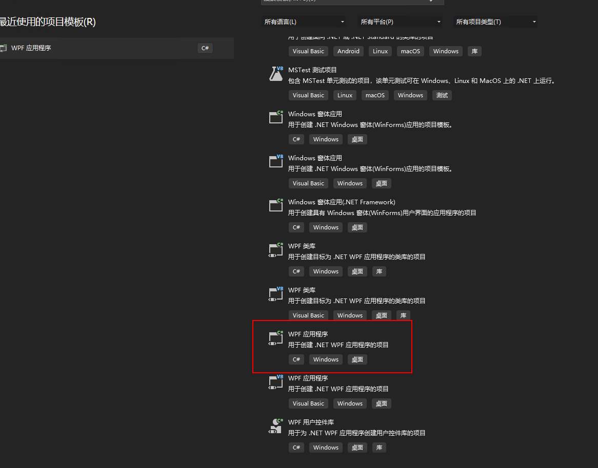

## 随笔日记记录
> 根据时间内容随时记录看到和学习到的一些知识和内容


## 2023年11月11日   星期六

### Devops 的概念和理解
DevOps是一种软件开发和IT运维的实践方法，旨在通过加强开发团队与运维团队之间的协作与沟通，实现软件应用的快速交付、高质量和可靠性。
DevOps包含以下几个主要方面：

1. 自动化：自动化是DevOps的核心原则之一。它涉及使用工具和脚本来自动执行软件开发和部署过程，从而提高效率、降低错误和减少重复工作。

2. 持续集成和持续交付（CI/CD）：CI/CD是DevOps的关键实践，旨在将代码频繁集成到共享存储库中，并自动构建、测试和部署软件。这样可以快速检测和解决问题，缩短交付时间，并提高产品质量。

3.  配置管理：配置管理涉及对软件环境进行版本控制和自动化管理。通过使用工具如Ansible、Chef或Puppet，可以确保各个环境的一致性，并能够快速复制和部署环境。

4.  容器化和容器编排：容器化技术（如Docker）使得应用程序更易于部署、管理和扩展。容器编排工具（如Kubernetes）帮助管理大规模容器化应用程序的自动化部署和管理。

5.  监控和日志管理：DevOps需要建立有效的监控和日志管理系统，以便实时跟踪应用程序的性能、健康状况和异常情况。这些信息对于快速定位和解决问题至关重要。
### IPD产品开发
IPD指的是"产品开发流程"（或"产品开发过程"）, 是指将一个新产品从概念到实际推向市场的整个过程。它涉及到研究、设计、制造、测试和推广等一系列步骤
IPD的全称是“Integrated Project Delivery”，即集成产品开发

1. 开源软件：

    Odoo（原名OpenERP）：它是一个全功能的企业资源规划（ERP）软件。Odoo提供了各种模块，包括项目管理、任务管理、采购管理等，可以用来支持企业的IPD流程。

    Redmine：这是一个灵活且易于使用的项目管理工具。它提供了任务跟踪、问题追踪、版本控制等功能，适合用于IPD流程中的项目管理。

    Tuleap：它是一个开源的协作平台，专注于软件开发和项目管理。Tuleap提供了项目追踪、需求管理、文档管理等功能，非常适合IPD流程的实施。

2. 商业软件系统：

    Microsoft Project：这是一款功能强大的项目管理软件，广泛应用于企业IPD流程。它提供了进度计划、资源分配、成本管理等功能，并具有良好的可视化和报告功能。

    Oracle Primavera：这是一套专业的项目和端到端解决方案，适用于复杂的工程和建筑项目。它提供了项目规划、风险管理、资源管理等功能，非常适合大型企业的IPD流程。

    Jira：这是一款广泛使用的敏捷项目管理工具，适用于软件开发和IT团队。Jira提供了任务追踪、缺陷管理、故事板等功能，可以支持敏捷IPD流程的实施。
## 自动化运维和DEvops 的理解  
   目的是加强Dev  和OPS 之间的沟通和协助，部署和运维全程自动化进行
* Kubernnetes 的认识和实际使用
  k8s 是开源的容器编排平台。主要用于自动化应用程序的部署和管理。主要组件有 Master 节点和worker 节点
  Master节点负责资源调度和管理，

* 300多台服务器，如何进行管理 ？
  堡垒机，ansible 
* LVS  nginx,Haproxy  有啥区别
LVs ： 是基于四层转发的 （linux virtual  server)
HAProxy ： 是基于四层和七层转发的。专业的代理服务器
Ngixn： 是web和缓存服务器，可以做七层的转发

## 2023年11月13日   星期一

### Deeplearning 深度学习

### **机器学习（内容）**
>  机器学习是一种人工智能的领域，其目的是通过让计算机系统从数据中学习和改进，以实现特定任务的自动化。与传统的编程方式不同，机器学   习模型可以从大量的数据中提取模式和规律，并使用这些模式进行预测、决策或执行特定任务。
```
机器之所以可以自我学习，是因为机器学习模型具备了学习能力的算法和结构。
这些模型可以根据输入的数据进行自我调整和改进，以提高其在特定任务上的性能。
通过不断地暴露给模型更多的数据和反馈，它可以逐步优化自己的表现，并提供更准确的输出结果。
这种自我学习的能力使得机器能够处理复杂的问题，并且在面对新的情况时具备适应性和智能化的能力

```
<!-- 读文章 -->
### **(技术文章)**
来自微信公众号 民工哥技术之路  
文章名字   还是决定去华为了
  重要内容摘要
*  入职薪酬
*  长期预期薪酬
*   offer 在同龄人中的相对档次
*  业务匹配度
*  成长空间
*  工业界的影响力
*  学术界的影响力
*  Work-life  balance 
*  领导熟悉度
*  工作稳定程度
*  公司文化
*  公司品牌
*  部门前景
*  技术积累
*  大牛老板

## 2023年11月15日   星期三
**Mysql基本的问题**

1. char varchar 的区别？


对于经常需要变化的数据来说，CHAR 比 varchar  更好，

2. TRUNCAT 和 delete 的区别
Delect 是从表中删除指定的一行
Trucat  是永久性的删除某一行

3. 触发器是啥？ 都有啥


4. Float 和double 的区别是啥 


5. 


## 2023年11月16日   星期四   

### Redis 的内容


## 2023年11月16日   星期四   

ETL (SSIS,kETTLE)  Extract Transform  Load  
提取，转换，加载
ETL 的主要目标是将异构的数据源整合为一致的，可分析的数据集，支持业务决策，报表生成，数据分析等


## 2023年11月18日  星期六   

###  常用的嵌入式开发平台有以下几种：


    Arduino：Arduino是一种简单易用的开源电子原型平台，适用于初学者和专业人士。它提供了一个方便的开发环境和丰富的库函数，支持多种硬件扩展板，如传感器、执行器等。

    Raspberry Pi：Raspberry Pi是一款小型的低成本计算机板，具有强大的处理能力和丰富的接口。它可以运行Linux操作系统，并支持多种编程语言，如Python、C/C++等。

    STM32：STM32(意法半导体）系列是STMicroelectronics推出的一款基于ARM Cortex-M内核的32位微控制器。它具有高性能、低功耗、丰富的外设和广泛的开发工具支持，适用于各种嵌入式应用领域。

    ESP8266/ESP32：ESP8266和ESP32是乐鑫科技推出的一款集成Wi-Fi功能的芯片，可用于构建物联网设备。它们具有小巧的体积、低功耗和丰富的通信接口，适合于无线通信和物联网项目的开发。

    BeagleBone：BeagleBone是一款基于ARM架构的开发板，具有丰富的接口和强大的处理能力。它支持多种操作系统，如Linux和Android，适合于构建复杂的嵌入式系统。


ESP8266/ESP32  是基于tensilica 处理器架构  

```
Arduino官方网站：提供了丰富的实验指南、示例代码和教程，适合初学者入门。
[Raspberry Pi官方网站](https://www.raspb)

```
乐鑫科技 的开发板是国内做的，

MCU代表微控制器单元（Microcontroller Unit），是一种集成了中央处理器（CPU）、内存和输入/输出接口等功能的小型计算机系统   
串口通信和I2C/SPI总线是常用的数据通信协议  

::: warning
串口通信：使用通信端口（例如RS-232）来发送和接收数据。发送方将数据转换为电平信号，并通过物理线连接到接收方。接收方解析电平信号并还原数据。

I2C总线：使用两根线（SDA和SCL）进行串行传输。发送方将数据放置在SDA线上，并通过SCL线发送时钟信号。接收方在特定时钟边沿读取数据。

SPI总线：使用多个线（主时钟线、主片选线、MISO、MOSI）进行全双工传输  
:::

单片机就是 MCU    

###  I2C总线详解

> I2C总线是一种常用的通信接口 
 I2C总线是由Philips公司开发的一种简单、双向二线制同步串行总线。它只需要两根线即可在连接于总线上的器件之间传送信息

I2C具有如下特点：

①只需要两条总线；串行数据线(SDA)和串行时钟线(SCL)。

②连接到总线的每个设备都是可通过唯一地址进行软件寻址的，并且始终存在简单的控制器/目标关系；控制器可以作为控制器发送器或控制器接收器运行。

③这是一种真正的多控制器总线，包括冲突检测和仲裁，以防止两个或更多控制器同时启动数据传输时出现数据损坏。

④面向8位的串行双向数据传输速率在标准模式下最高可达100 kbit/s，在快速模式下最高可达400 kbit/s，在快速增强模式下最高可达1 Mbit/s，在高速模式下最高可达3.4 Mbit/s。

⑤串行、面向8位、单向数据传输，在超快速模式下最高可达5 Mbit/s。

⑥片内滤波可抑制总线数据线上的尖峰信号，以保持数据完整性。

⑦可以连接到同一总线的IC数量仅受最大总线电容的限制。在某些条件下（如简化SCL时钟频率、增加输出驱动力、增加缓冲器件、改进上拉电阻等），可以允许更大的电容。

⑧极低的电流消耗，高抗扰度，宽电源电压范围，宽工作温度范围。

⑨硬件的最简化，给芯片设计师减轻了节省输出引脚的压力，给芯片应用商带来了成本降低、空间减小、测试方便、易于升级等诸多好处，为芯片应用工程师的产品开发带来灵活多样的选择方案、方便快捷的调试手段、开发周期的缩短、开发效率的提高等好处。

### Raspberry pi


## 2023年11月20日  星期一
无内容

## 2023年11月21日  星期二

RTOS（实时操作系统）Real-Time Operating System   [！FreeRTOS](https://www.freertos.org/)

>Nuttx是使用C和C++语言开发的。它是一个基于实时操作系统（RTOS）的嵌入式操作系统，专为资源受限的系统设计。Nuttx的代码主要由C语言编写，但也可以使用C++进行开发

日常可以使用的RTOS包括FreeRTOS、UCOS、RT-Thread等
* FreeRTOS 的描述
FreeRTOS及其在意法半导体STM32平台，乐鑫科技ESP32平台和Arduino平台上的开发与运用。

可实现：任务管理、时间管理、信号量、消息队列、内存管理、记录功能 
>FreeRTOS 是一个可裁剪、可剥夺型的多任务内核，而且没有任务数限制。FreeRTOS 提供了实时操作系统所需的所有功能，包括资源管理、同步、任务通信等。
FreeRTOS 是用 C 和汇编来写的，其中绝大部分都是用 C 语言编写的，只有极少数的与处理器密切相关的部分代码才是用汇编写的，FreeRTOS 结构简洁，可读性很强！最主要的是非常适合初次接触嵌入式实时操作系统学生、嵌入式系统开发人员和爱好者学习。
最新版本 V9.0.0（2016年），尽管现在 FreeRTOS 的版本已经更新到 V10.4.1 了，但是我们还是选择 V9.0.0，因为内核很稳定，并且网上资料很多，因为 V10.0.0 版本之后是亚马逊收购了FreeRTOS之后才出来的版本，主要添加了一些云端组件，一般采用 V9.0.0 版本足以.   


## 2023年11月23日  星期四

Linux 内核原理指的是Linux操作系统的核心组件，它是操作系统的基础，负责管理计算机的硬件资源，并提供了各种系统服务和功能。Linux内核被设计为开放源代码，因此任何人都可以查看、修改和扩展它。

Linux内核原理涵盖了以下几个关键概念：

    进程管理：Linux内核负责创建、调度和管理进程（程序的执行实例），包括分配资源、上下文切换和进程间通信等。
    内存管理：内核跟踪和管理计算机的物理内存和虚拟内存，包括内存分页、页面置换和内存保护等。
    文件系统：内核提供文件系统接口，用于管理文件和目录，包括文件权限、访问控制和磁盘空间分配等。
    设备驱动程序：内核提供设备驱动程序接口，使应用程序能够访问计算机的硬件设备，如磁盘驱动器、网络接口卡等。
    网络协议栈：内核实现了各种网络协议，如TCP/IP协议族，用于实现网络通信和互联网连接

## 2023年11月24日  星期五

Windows Presentation Foundation (WPF) 

>Qt 是一个跨平台的开发框架，可以用于构建各种类型的应用程序，包括图形用户界面（GUI）应用程序。Qt 在开源社区中以 LGPL 许可证发布，这意味着你可以自由地使用 Qt 框架来开发软件，而不需要支付版权费用。


## 2023年11月27日  星期一
学习一下Winform 和 WPF 的区别

>**WINform Windows Forms**是一种基于传统Win32 API的技术，使用C#或VB.NET语言进行开发。它提供了一组用于创建用户界面的控件，如按钮、文本框、标签等。WINform使用事件驱动模型，在代码中处理用户交互，并且可与其他技术（如ADO.NET）结合使用。

>**WPF（Windows Presentation Foundation**是一种更现代化、更强大的UI框架，也是使用C#或VB.NET进行开发。它采用XAML（可扩展应用程序标记语言）来描述用户界面，将界面和逻辑分离，使开发人员可以更灵活地设计应用程序的外观和行为。WPF还提供了强大的数据绑定、样式和动画功能，以及易于定制和扩展的控件模型。 

XAML （ extensible  appliction Markup Lanague) 可拓展应用程序标记语言

### WPF 的文件结构
1. MainWindow.xaml 文件是WPF 应用程序的主窗口，它包含了应用程序的用户界面，
2. APP.xaml 是WPF 应用程序级别资源文件，它可以定义应用程序范围内的资源，如样式，模板，转换等

### Mahapps.Metro 框架的使用

>来自德国公司开源的UI框架，专为WPF（Windows Presentation Foundation）应用程序设计。该框架提供了丰富的现代化UI控件和主题样式，旨在帮助开发人员快速构建具有吸引力和一致性的用户界面。

**创建第一Mahapps的程序**   

1. 安装MahApps.Metro 
  首先创建一个WPF 项目，然后使用NUget来安装MahApps.Metro 的程序包

  
2. 引用MahApps.metro 的命令空间   

>namespace 是一种组织和管理代码的机制，它提供了一种将相关类，接口，结构和其他类型组织在一起的方式，以避免命名冲突
点击工具--NUGet包管理器---管理解决方案的NU固态程序包
  

3. 在线搜索下载这个Mahapps的包   

 


4. 使用MahApps.Metro的控件
* 引用MahApps的命名空间
在XAML文件中，添加对MahApps.Metro命名空间的引用。例如，在Window标签中添加xmlns:metro="clr-namespace:MahApps.Metro.Controls;assembly=MahApps.Metro"。

*  替换默认的Windows类
将默认的Window类替换为MahApps.Metro提供的MetroWindow类。在XAML文件中，将Window标签替换为metro:MetroWindow标签。在代码文件中，将继承的Window类替换为MetroWindow类  

* 应用MahApps 的样式
在App.xaml文件中，引用MahApps.Metro提供的内置样式。在Application.Resources标签内添加ResourceDictionary，并在其中添加对MahApps.Metro样式的引用。例如，添加<ResourceDictionary Source="pack://application:,,,/MahApps.Metro;component/Styles/Controls.xaml"/>。  

* 使用 MashApps.Metro控件
在XAML文件中使用MahApps.Metro提供的控件。例如，使用metro:Tile控件创建一个瓦片式按钮，或者使用metro:TreeView控件创建一个树形视图
