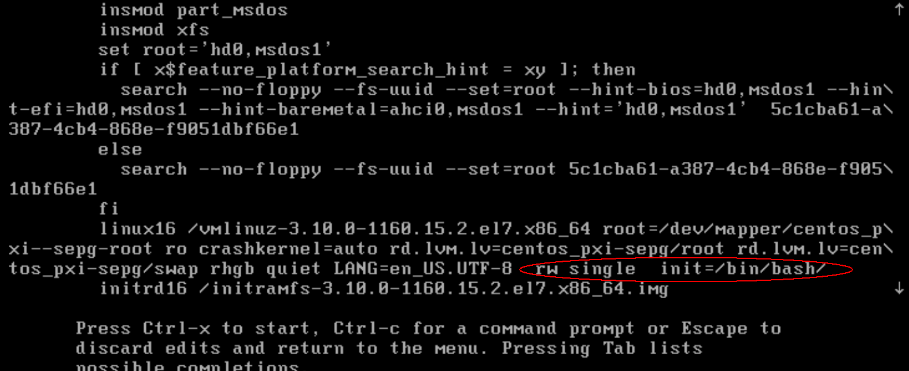
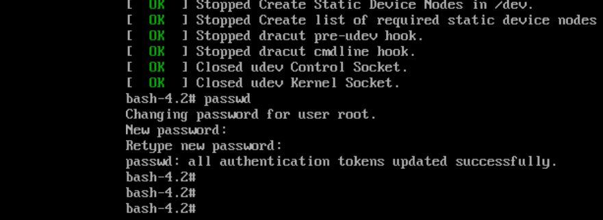

### Linux使用命令

### Linux是一種自由和開放源碼的類UNIX作業系統。 该操作系统的内核由林纳斯·托瓦兹在1991年10月5日首次发布，再加上使用者空間的應用程式之後，就成為了Linux作業系統。 Linux也是自由软件和开放源代码软件发展中最著名的例子

> Debian 和 CentOS 的对比

    Debian 的优点：
        强大的社区支持以及活跃度，从 CentOS 被商业化收购后，Debian 收到中、小企业的关注度较多；
        系统管理、配置较为简单，对系统有很好的掌控程度，配置网络、防火墙等功能轻松简单；
    Debian 的缺点：
        apt 安装工具对于依赖的处理没有 yum 和 npm 对于包及其依赖的管理那么优秀，在离线安装包及其依赖时，apt 的安装问题会让你比较头疼；
        对于系统日志的管理没有 CentOS 那么优秀和详尽；
    CentOS 的优点：
        基于最强大的商业Linux操作系统 - RedHat， 网上的资料非常非常的多，目前使用的个人群体也非常非常多，容易找到问题对应的资料；
        强大的操作系统管理以及设计，很多关于Linux的讲解书籍都是以CentOS为例子来进行讲解的；
        yum / npm 的包管理比 apt 要更优秀一点，更容易在；
        受众面较大，选择的企业很多～
    CentOS 的缺点：
        未来的前景不被开源社区看好，好多公司已经开始更改技术栈；
        BIND 的配置管理混乱，没有在 Debian 下对于BIND服务配置文件流畅度那么好；
        相关的系统配置、网络配置的配置比Debian较为复杂；


###  1. 日常使用命令
#### 1.`查询当前防火墙开启的端口`和开启端口

``` shell
firewall-cmd --zone=public --list-ports			 ### 查询开启的端口
### 开启服务器防火墙的8080端口
firewall-cmd --zone=public --add-port=8080/tcp --permanent    
firewall-cmd --reload      ### 应用
```
#### 2.设置mysql开机自动运行_避免重启导致服务不启动
```
systemctl enable mysqld		
systemctl daemon-reload		

```

#### 3.查询最近登录三次的信息
last -a | head -3	

#### 4.显示完整的时间
```
date '+%c'

```
#### 5.显示出开启可以自动启动的程序
```
systemctl list-unit-files |grep enabled
```

#### 6.修改一个文件到所属的组   
```
sudo chgrp test test.txt
```


### 5.1 关闭指定程序的开机自启动


#### 6.查询系统的账户
cut -d : -f 1 /etc/passwd

#### 7.查询系统可以登录的账户

cat /etc/passwd | grep -v /sbin/nologin | cut -d : -f 1

### 8.修改当前的DNS--（临时修改）
查询命令 cat /etc/resolv.conf
修改 的话，更改该文件内部的nameserver

### 9.查询进程占用资源的
查询内容占用前十名
ps aux | sort  -k4nr | head -10

查询CPU 占用前十名

ps aux | sort  -k3nr | head -10
### 10.自动更新程序导致内存大量被占用(Ubutun OS 22)

关闭命令

sudo systemctl disable unattended-upgrades.service

### 11.查询正在运行的端口
sudo ss -tulpn | grep LISTEN    

sudo netstat -tunlp  用netstat检查监听端口和程序   

sudo  netstat -tunapl |grep 53   

### 12. 禁用或者关闭 IPV6
  暂时禁用，重启恢复 sudo sh -c 'echo 1 >/proc/sys/net/ipv6/conf/ens160/disable_ipv6'

13. 删除卸载 bind 的软件
 *. 


###  2. 网络相关命令
      nmap，也就是Network Mapper，是Linux下的网络扫描和嗅探工具包。											
      nmap是在网络安全渗透测试中经常会用到的强大的扫描器						
```
nmap -p- T4  127.0.0.1    ### 
nmap -sP 172.16.0.*			### 寻找所有在线的主机	

```

### 3.异常处理问题      

#### 忘记root密码，无法进入系统（使用的是centos系统）
1 - 在启动grub菜单，选择编辑选项启动   

2 - 按键盘e键，来进入编辑界面   

3 - 按方向键下键↓，找到设置语言的地方，如LANG=en_US.UTF-8，在后面追加rw single init=/bin/bash


4 - 现在按下 Control+x ，使用单用户模式启动   

5 - 现在，可以使用下面的命令访问系统
6 - 重置密码

使用命令 passwd root

7 - 更新系统信息

touch /.autorelabel

8 - 输入exec /sbin/init命令重启系统

exit

9 - 重启你的系统

reboot


-------
##  ubuntu 22 LTS 版本
#### 1.查询Ubuntu的版本和信息
  使用命令 cat /etc/os-release  或者 hostnamectl 
#### 2.查询内核信息
   使用命令  uname -r

#### 3.apt 安装bind
```
sudo apt-get install bind9-host dnsutils
sudo apt-get install bind9

```
#### 4. 重启bind 命令
sudo systemctl restart bind9.service

#### 5. 测试正向区域文件,请使用如下命令
```
named-checkzone example.com /etc/bind/db.example.com

```

#### 5.如何查glibc的版本
```
ldd --version
```

#### 6.查询 ubuntu 的版本
```
lsb_release -a
```
#### 7. 要验证是否正确设置DNS地址，请运行命令systemd-resolve --status | grep 'DNS 
如果显示不出来这个命令，请先安装
   sudo apt-get install systemd

### 8.查询端口运行的程序
netstat -tuln | grep <端口号>  或者
ss -tuln | grep <端口号>


### 9.修改ubuntu的仓库源
将所有常用镜像源保存在/etc/apt目录下，并命名为类似source.list.aliyun的形式，需要使用时直接复制替换source.list文件即可。


### 故障排除
1.** server can't find www.baidu.com: REFUSED
   

2. 监听查询命令

sudo tcpdump  -n -i  ens160 host  172.19.172.188  and port  53

3.修改所属组
sudo  chgrp  bind  bind.keys
4. ubuntu  使用sodu的命令很慢，
> 原因：Ubuntu Server被设计成一种类似于分布式的操作系统网结构，允许/etc/sudoers中的成员不在本机上。从而sudo时会先从网络上寻找可能的sudoer然后才是本地. 而这10s左右的时间就是整个DNS流程的最长时间.
> 解决方案：首先输入hostname，得到本机当前的互联网名称（大概跟windows下的计算机名称差不多）。然后使用su或sudo打开/etc/hosts，添加一行：
```
  127.0.0.1 <TAB> hostname <TAB> hostname.localdomain
```
4.修改DNS 的信息
 /etc/systemd/resolved.conf 文件


### 卸载bind 和清楚配置文件
* 停止BIND服务,在终端中输入以下命令以卸载BIND软件
   sudo apt remove bind9
*   删除bind 相关配置文件
 sudo rm -rf /etc/bind
 *  清理残留文件
    sudo apt autoremove


