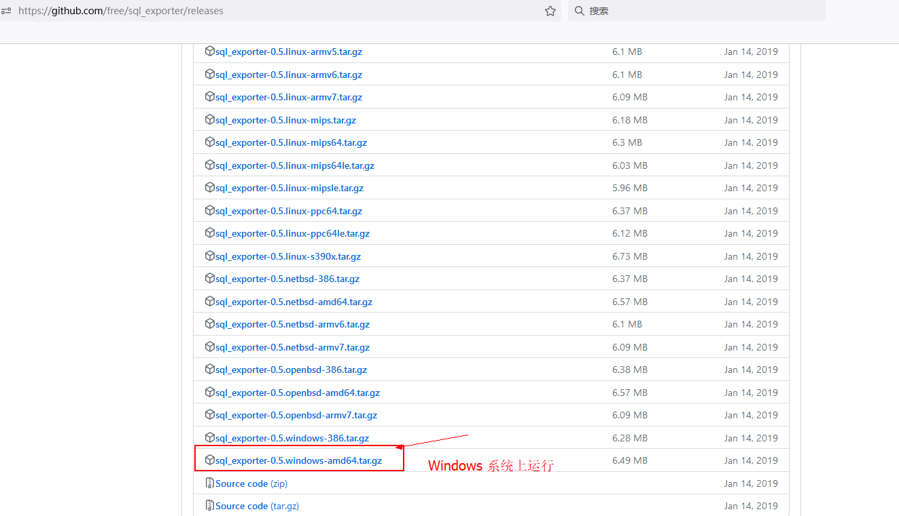
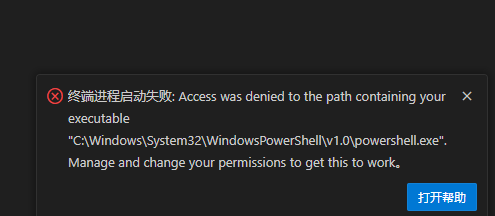
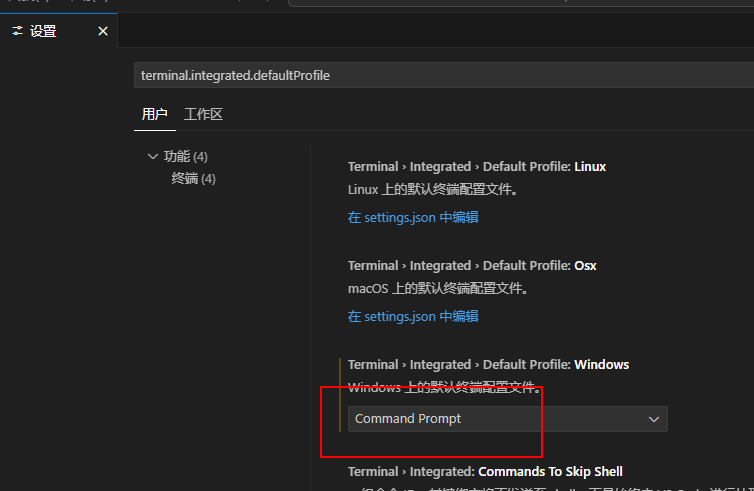

### 网络侧运维

### Grafana 和 prometheus  (普罗米修斯)
表达式的意思
  1. Math表达式：Math表达式用于对指标进行数学运算或转换。您可以使用Math表达式来计算指标的总和、平均值、最大值、最小值等。例如，sum()函数用于计算指标的总和，avg()函数用于计算指标的平均值，max()函数用于计算指标的最大值，min()函数用于计算指标的最小值。您可以根据需要选择适当的Math表达式，并将其应用到指标上。

2. Reduce表达式：Reduce表达式用于对时间序列数据进行降维操作。它可以将多个时间序列数据聚合为一个单一的时间序列数据。常用的Reduce表达式包括sum()、avg()、max()和min()等。例如，sum()函数将多个时间序列数据的值相加，生成一个新的时间序列数据。您可以根据需要选择适当的Reduce表达式，并将其应用到时间序列数据上。

3. Resample表达式：Resample表达式用于对时间序列数据进行重新采样。它可以将时间序列数据的采样频率调整为更高或更低的频率。常用的Resample表达式包括5m、1h、1d等。例如，5m表示将时间序列数据的采样频率调整为每5分钟一次。您可以根据需要选择适当的Resample表达式，并将其应用到时间序列数据上。

4. Classic条件：Classic条件用于设置触发报警的条件。它可以根据指标的值、时间范围和阈值来判断是否触发报警。常用的Classic条件包括>（大于）、<（小于）、==（等于）、!=（不等于）等。例如，value > 100表示当指标的值大于100时触发报警。您可以根据需要选择适当的Classic条件，并将其应用到指标上。

使用这些表达式和条件，您可以根据具体的需求来配置Grafana的Alert规则。根据您的指标和报警条件，选择适当的Math表达式、Reduce表达式、Resample表达式和Classic条件，并将它们组合在一起，以实现您所需的报警逻辑。


##### 指标解释

"system exception dispatches"是一个指标，用于衡量系统中发生的异常调度次数。它表示系统在运行过程中发生的异常事件的数量。

具体来说，"system exception dispatches"指标表示系统在处理异常时触发的调度次数。当系统遇到异常情况时，例如硬件错误、软件错误或其他异常事件，它会触发相应的异常处理机制来处理和调度这些异常。每次发生异常调度时，"system exception dispatches"指标的值就会增加。

该值的大小可以用来评估系统的异常情况和稳定性。较高的"system exception dispatches"值可能表示系统遇到了较多的异常情况，可能需要进一步调查和解决。较低的值则可能表示系统相对稳定，没有发生太多的异常事件。

需要注意的是，具体的"system exception dispatches"值的大小没有一个固定的标准或阈值来表示正常或异常状态。它的解释和评估应该结合具体的系统环境和上下文来进行。如果您关注系统的异常情况，建议结合其他相关指标和日志信息来进行综合分析和判断。

#### OPS   每秒读写磁盘

磁盘的监控指标中，"I/O OPS"代表每秒的输入/输出操作数（Input/Output Operations Per Second），而"每秒磁盘读写"代表每秒的磁盘读取和写入操作数。

"I/O OPS"表示在每秒钟内执行的磁盘输入和输出操作的数量。这个指标可以用来衡量磁盘的工作负载和性能。较高的I/O OPS值通常表示磁盘正在处理大量的读写请求，可能是由于高负载的应用程序或者磁盘访问瓶颈引起的。

"每秒磁盘读写"表示每秒钟内磁盘读取和写入的数据量。这个指标可以用来衡量磁盘的数据传输速度。较高的每秒磁盘读写值通常表示磁盘正在处理大量的数据读写操作，可能是由于大量的数据访问或者高负载的应用程序引起的。

对于一般的磁盘，正常水平的I/O OPS和每秒磁盘读写值会根据具体的硬件规格、应用程序需求和负载情况而有所不同。一般来说，较低的I/O OPS和每秒磁盘读写值可能表示磁盘处于较轻的工作负载状态，而较高的值可能表示磁盘正在处理较重的工作负载。

要确定正常水平的I/O OPS和每秒磁盘读写值，建议参考磁盘的规格和性能指标，以及监控工具或操作系统提供的性能数据。这样可以获得更具体和准确的参考值，并根据实际情况进行评估和调整。

## 使用 Prometheus 监控MSS SQL的数据库

### 1. 安装SQL-exporter 的程序

> 参考资料
 sql_exporter使用、采集器源码： https://github.com/free/sql_exporter 
M SSQL简略仪表盘：https://grafana.com/grafana/dashboards/9336   
更多、更高级的sql server采集指标：https://github.com/influxdata/telegraf/tree/master/plugins/inputs/sqlserver?tdsourcetag=s_pctim_aiomsg
 sql server 对象监控 参考：https://docs.microsoft.com/zh-cn/sql/relational-databases/performance-monitor/use-sql-server-objects?view=sql-server-ver15

### 2. 下载文件，并且运行



### 3.将这个文件设置成一个程序，后台进行运行

## 使用代理服务器进行部署上网
如下是一些常用的代理的网址
> archive.ubuntu.com  
apt.kubernetes.io 
asia-northeast2-docker.pkg.dev    
auth.docker.io   
cdn03.quay.io
download.docker.com    
esm.ubuntu.com    
packages.cloud.google.com    
prod-registry-k8s-io-ap-northeast-1.s3.dualstack.ap-northeast-1.amazonaws.com    
production.cloudflare.docker.com    
quay.io    
registry-1.docker.io    
registry.k8s.io    
dl.k8s.io    

## 使用 Prometheus 监控Mysql 的数据库
    Vscode 打开的时候报错


解决方法:设置这个地方的方式



### 1. 安装mysql-exporter 的程序

> 参考资料
 mysql_exporter使用、采集器源码： https://github.com/prometheus-community/mysql_exporter 
Mysql简略仪表盘：https://grafana.com/grafana/dashboards/11074   
更多、更高级的mysql采集指标：https://github.com/prometheus-community/mysql_exporter/tree/main/contrib
 mysql 对象监控 参考：https://github.com/prometheus-community/mysql_exporter/tree/main/contrib

### 2. 下载文件，并且运行


### 3.将这个MYSQL exporter文件设置成一个程序，后台进行运行
```
272  tar xvfz mysqld_exporter-0.16.0.linux-amd64.tar.gz 
274  cd mysqld_exporter-0.16.0.linux-amd64/
创建systemd 服务单元
进行系统的服务的创建
sudo vi /etc/systemd/system/mysqld_exporter.service

[Unit]
Description=MySQL Exporter
After=network.target

[Service]
ExecStart=/home/datad2/mysqld_exporter -config.my-cnf=.my.cnf
Restart=always
RestartSec=5

[Install]
WantedBy=multi-user.target

// 启动服务
sudo systemctl start mysqld_exporter
// 查看服务状态
systemctl  status  mysqld_exporter.service
// 开机自启
sudo systemctl enable mysqld_exporter 
```
sudo netstat -tunlp | grep 9104

 执行mysql_exporter -config.my-cnf=.my.cnf 的时候报错

 手动执行命令
 ./mysqld_exporter --config.my-cnf=/home/data2/mysql_exporter/mysql.cnf
 ./home/data2/mysql_exporter/mysqld_exporter --config.my-cnf=/home/data2/mysql_exporter/mysql.cnf
系统服务的文件: 特别注意文件目录的正确性
root@ubuntuser:/etc/systemd/system# cat mysqld_exporter.service
[Unit]
Description=MySQL Exporter
After=network.target

[Service]
ExecStart=/home/data2/mysqld_exporter/mysqld_exporter --config.my-cnf=/home/data2/mysqld_exporter/mysql.cnf
Restart=always
RestartSec=5

[Install]
WantedBy=multi-user.targe
root@ubuntuser:/etc/systemd/system#


4. 通过docker 来运行 mysql_exporter 

[client]
user = exporter
password = 2024N
host = 172.18.0.9(配置docker中的数据库的地址)
port = 3306


```


docker pull prom/mysqld-exporter
docker run -d -p 9104:9104 -e DATA_SOURCE_NAME="exporter:123456@tcp(192.168.6.223:3306)/" prom/mysqld-exporter
```
但是有个问题，docker hub 一直拉取镜像总是失败


### 1. 安装black-exporter 的程序

#### 1.1 使用nssm 来进行服务管理
> nssm 是一款不错的服务助手。srvany 以及其他服务助手程序很糟糕，因为它们无法处理作为服务运行的应用程序出现的故障。如果你使用这类程序，
  可能会看到服务显示已启动，但实际上应用程序已经崩溃。nssm 会监控正在运行的服务，一旦服务崩溃就会重启它。使用 nssm，你就能知道，如果一个服务显示正在运行，那它确实是在运行。另外，如果你的应用程序表现良好，你可以配置 nssm，让它无需承担重启应用程序的责任，而是让 Windows 来处理恢复操作


```
# 创建服务
nssm install black_exporter   C:\software\blackbox_exporter\black_exporter.exe

### 删除指定的服务
nssm remove black_exporter

```
由于blackbox_exporter 是一个黑盒监控，且安装在不同的主机上，修改配置如下：

1.检查promethus配置文件的命令
promtool check config /path/to/your/prometheus.yml
2.热更新配置文件的更改

3.
curl -X POST http://127.0.0.1:9090/-/reload

4.查询prometheus 的版本命令
prometheus --version
5. Grafana 的模板的ID 是 11074  blackbox exporter 的模板ID是 9172

黑盒监控是以故障为导向当故障发生时，黑盒监控能快速发现故障。
白盒监控则侧重于主动发现或者预测潜在的问题
```

params:
      module: [icmp]  #plling
    file_sd_configs:
    - files: ['/usr/local/prometheus/sd_config/hk.yml']
    relabel_configs:
      - source_labels: [__address__]
        target_label: __param_target
      - source_labels: [__param_target]
        target_label: instance
      - target_label: __address__
        replacement: 192.168.6.247:9115

```
另一个文件：

 cat sd_config/hk.yml
- targets: ['128.14.237.64']
  labels:
    HK: '台湾台北'

     static_configs:
      - targets:
        - 192.168.0.125 # 要探测的目标主机，例如192.168.0.51
        - 172.16.20.211
        - 172.16.25.113
        - 172.16.25.113
        - 172.16.24.2
###  使用