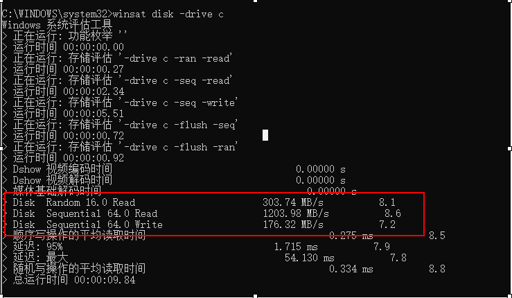

## 工具命令和其他

### Windows10 测试磁盘读写速度   

我们在检测硬盘分区读写性能的时候，可以使用win10 自带的测试命令来测试此硬盘的最大读写性能！

     在左下角搜索框输入“cmd”，并点击“以管理员身份运行”。
    输入命令“winsat disk -drive 盘符”，并点击“回车”。例如

 winsat disk -drive  c

红色框结果为：

从上到下，分别是：
* 随机读取速度:  303MB/s
* 顺序读取速度: 1203MB/s
* 顺序写入速度:  176MB/s  

