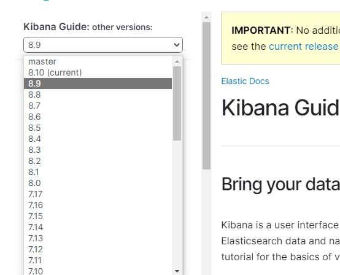

## 工具命令和其他

###   Docker 的相关

### 云原生环境是一种构建和运行应用程序的方法，旨在充分利用云计算的优势。它强调将应用程序设计为微服务架构，并利用容器化、动态编排、自动化管理和可观测性等技术来实现高度可扩展、弹性和可靠的系统。

  要在本地搭建一个云原生环境进行学习，可以按照以下步骤进行操作：

    安装容器运行时：选择一种容器运行时，如Docker，根据官方文档进行安装。Docker是目前最流行的容器化技术，可以在本地环境中轻松构建、运行和管理容器。

    部署容器编排工具：选择一种容器编排工具，如Kubernetes，根据官方文档在本地环境中部署一个Kubernetes集群。可以使用Minikube或kind等工具来搭建一个单节点的Kubernetes集群，或者使用Kubernetes发行版如kubeadm来搭建多节点的集群。

    构建示例应用程序：选择一个简单的示例应用程序，如一个Web服务，将其容器化并创建相应的Docker镜像。可以使用常见的编程语言和框架，如Node.js、Python、Java等。

    编排和部署应用程序：使用Kubernetes的命令行工具（kubectl）或Web界面（如Kubernetes Dashboard）来创建Kubernetes部署文件（Deployment），描述如何部署和运行应用程序的容器。然后，使用kubectl apply命令将部署文件应用到Kubernetes集群中，启动应用程序的容器实例。

    验证和测试：通过访问应用程序的服务，验证应用程序是否正常运行。可以使用kubectl命令查看Pod、Service、Ingress等资源的状态，以及应用程序的日志输出。
### 基本使用的命令
* 查询docker 的信息   
  docker  info
* 查询 docker 运行的信息   
   docker ps  -a (显示全部的包含停止的)
* 查询当前镜像库的信息
   docker images
* 查询工作模式   
 ```
docker info --format '{{.Swarm.LocalNodeState}}'
 ```
 这个命令会返回Docker Engine的工作模式信息。可能的返回值包括：

    inactive：表示Docker Engine未运行在集群模式下，没有启用集群管理功能。
    active：表示Docker Engine正在运行在集群模式下，启用了集群管理功能。
    pending：表示Docker Engine正在尝试加入一个已经存在的集群，但还未完成加入过程。
    error：表示Docker Engine
* 通过Docker查询Elasticsearch可以拉取的版本号
  docker search elasticsearch  

*  只是想查看容器的日志
docker logs <container_id>

* 进入容器的交互式模式：选择您要访问的容器，并使用以下命令进入容器的交互式模式
docker exec -it <container_id> /bin/bash  
  docker exec -it 83bc80911439 /bin/bash

## 通过Docker部署和安装ELK环境

ELK Stack 简介

ELK 不是一款软件，而是 Elasticsearch、Logstash 和 Kibana 三种软件产品的首字母缩写。这三者都是开源软件，通常配合使用，而且又先后归于 Elastic.co 公司名下，所以被简称为 ELK Stack。根据 Google Trend 的信息显示，ELK Stack 已经成为目前最流行的集中式日志解决方案  

1. 安装Docker：首先，确保在你的机器上安装了Docker。根据你的操作系统，可以参考Docker的官方文档进行安装步骤。

2. 获取ELK镜像：ELK的官方团队提供了预配置的Docker镜像，可以直接使用。你可以通过Docker命令或使用Docker Compose来获取镜像
```
docker pull docker.elastic.co/elasticsearch/elasticsearch:7.14.0
docker pull docker.elastic.co/logstash/logstash:7.14.0
docker pull docker.elastic.co/kibana/kibana:7.14.0

---通过Docker查询Elasticsearch可以拉取的版本号
 docker  search logstash

```



3. 启动ELK环境  
```
docker run -d --name elasticsearch docker.elastic.co/elasticsearch/elasticsearch:7.14.0
docker run -d --name elasticsearch -e "discovery.type=single-node" docker.elastic.co/elasticsearch/elasticsearch:7.17.0 
docker run -d --name logstash docker.elastic.co/logstash/logstash:7.14.0
docker run -d --name kibana -p 5601:5601 docker.elastic.co/kibana/kibana:7.14.0

```
启动docker的时候 报错误

iptables failed: iptables --wait -t filter -A DOCKER ! -i docker0 -o docker0 -p tcp -d 172.17.0.2 --dport 5601 -j ACCEPT: iptables: No chain/target/match by that name. (exit status 1）
```
查看版本信息：iptables -V
查看帮助信息：iptables -h
列出当前表格的规则：iptables -L

```

报错误！ 

> ax virtual memory areas vm.max_map_count [65530] is too low, increase to at least [262144] 如何解决？ 显示虚拟内存的数量过低
Linux的虚拟内存区域数量是由系统内核决定的，它代表了系统可以为其进程分配的最大内存地址空间。虚拟内存区域是由物理内存页组成的，每个区域可以包含一页或多页。

虚拟内存区域的作用主要有以下几点：

* 提高内存利用率：由于物理内存是有限的，因此通过将程序所需的内存分割成多个独立的区域，系统可以将物理内存的利用率提高到更高的水平。
* 支持多进程并发执行：虚拟内存允许多个进程共享同一物理内存空间，使得多个进程可以并发执行，提高了系统的并发处理能力。
* 实现内存保护：虚拟内存技术将每个进程的内存空间隔离，防止不同进程之间的错误访问和修改，从而保护了数据的安全性。
* 支持动态内存分配：虚拟内存技术可以动态地分配和释放内存空间，使得程序可以根据需要动态地增长或缩小其内存使用量。   
    要查询Linux系统当前虚拟内存区域的数
1. 使用ulimit命令查看系统允许的最大进程数和虚拟内存使用量：
```
ulimit -u
ulimit -v
查询当前虚拟内存区域的数量值   sysctl vm.max_map_count

```
2. 使用cat /proc/user_beancounters命令查看系统当前进程的虚拟内存使用情况
```
cat /proc/user_beancounters

```

elasticsearch 的启动docker 命令

```
docker run --name elasticsearch -d -e ES_JAVA_OPTS="-Xms512m -Xmx512m" -e "discovery.type=single-node" -p 9200:9200 -p 9300:9300 docker.elastic.co/elasticsearch/elasticsearch:7.17.0 


命令说明：

-e "cluster.name=es-docker-cluster"：设置集群名称
-e "http.host=0.0.0.0"：监听的地址，可以外网访问
-e "ES_JAVA_OPTS=-Xms512m -Xmx512m"：内存大小
-e "discovery.type=single-node"：非集群模式
-v es-data:/usr/share/elasticsearch/data：挂载逻辑卷，绑定elasticsearch的数据目录
-v es-logs:/usr/share/elasticsearch/logs：挂载逻辑卷，绑定elasticsearch的日志目录
-v es-plugins:/usr/share/elasticsearch/plugins：挂载逻辑卷，绑定elasticsearch的插件目录
--privileged：授予逻辑卷访问权
--network itmentu-net ：加入一个名为itmentu-net的网络中
-p 9200:9200：端口映射配置
```
docker run -d --name kibana -e ELASTICSEARCH_HOSTS=http://172.19.108.10:9200  -p 5601:5601 docker.elastic.co/kibana/kibana:7.14.0

###  Kibana中文配置
```
#进入容器
docker exec -it kibana /bin/bash

#进入配置文件目录
cd /usr/share/kibana/config

#编辑文件kibana.yml
vi kibana.yml

#在最后一行添加如下配置
i18n.locale: zh-CN

#保存退出
exit

#并重启容器
docker restart kibana

```

### 配置logstash


