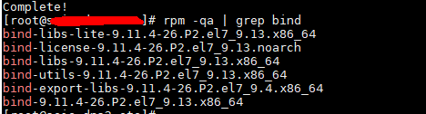
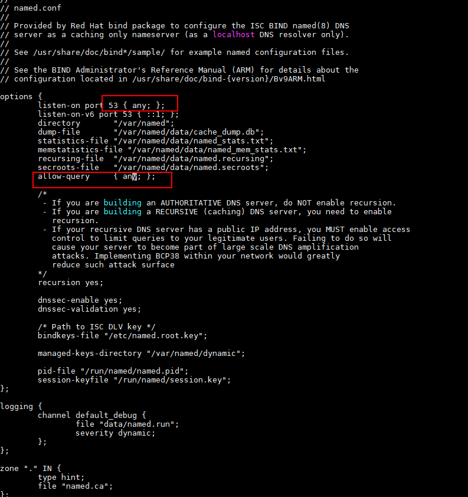
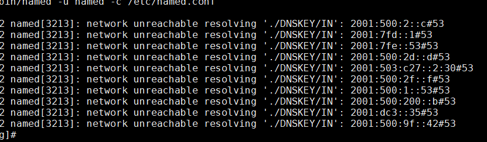

### 服务器侧运维

### Centos 下搭建DNS服务器   

Bind 是一款开源的 DNS 服务器软件，由美国加州大学 Berkeley 分校开发和维护的，按照 ISC 的调查报告，BIND 是世界上使用最多最广泛的域名服务系统，使用它代替Windows下的DNS

Red Hat Linux的各个版本已经包含DNS服务器的软件--Bind，一般不需要用户另行安装！
Bind (berkeley internet name domain ) 由ISC 进行维护，还维护了dhcpd
Bind是DNS协议的一种实现，是一个DNS Server程序，其守护进程名 为 named
软件包的功能

Bind：提供了域名服务的主要程序以及相关文件。

Bind-utils:提供了对DNS服务器的测试工具程序（nslookupdup、dig等）

Bind-chroot:为Bind提供了一个伪装的根目录以增强安全性

Caching-namserver:为配置Bind作为缓存域名服务器提供必要的默认配置文件，

查询本机是否有bind    rpm -qa | grep bind

> dns服务有什么用呢，尤其是内网的dns服务，其实用处还蛮大的，我见过的典型使用，是数据库跨机房多活。
如某mysql主机搭建在深圳机房，为了保证高可用，那我们可以给这台主库，维护多个深圳同城的跨机房半同步备机，在异地如上海还可以维护一个异步备机。当主机出问题时候，我们可以切换到备机去，而切换了之后，ip肯定就变了，此时就不得不要求客户端修改ip，非常麻烦。
一个可选的方案就是，给客户端服务提供一个域名，客户端服务通过域名获取对应的ip，然后再去和该ip建立连接。当数据库发生主备切换时，只需要修改dns服务端，把域名对应的ip进行修改，同时通知客户端服务进行重连（重连时就可以取到最新的ip），这样的话，不就可以做到数据库容灾切换，且不需要业务方修改配置了  
安装参考 https://lnsyyj.github.io/2019/01/06/%E5%A6%82%E4%BD%95%E5%9C%A8CentOS-7%E4%B8%8A%E5%B0%86BIND%E9%85%8D%E7%BD%AE%E4%B8%BA%E4%B8%93%E7%94%A8%E7%BD%91%E7%BB%9CDNS%E6%9C%8D%E5%8A%A1%E5%99%A8/


### DNS的工作原理及过程分下面几个步骤：

　　第一步：客户机提出域名解析请求,并将该请求发送给本地的域名服务器。

　　第二步：当本地的域名服务器收到请求后,就先查询本地的缓存,如果有该纪录项,则本地的域名服务器就直接把查询的结果返回。

　　第三步：如果本地的缓存中没有该纪录,则本地域名服务器就直接把请求发给根域名服务器,然后根域名服务器再返回给本地域名服务器一个所查询域(根的子域)的主域名服务器的地址。

　　第四步：本地服务器再向上一步返回的域名服务器发送请求,然后接受请求的服务器查询自己的缓存,如果没有该纪录,则返回相关的下第五步：重复第四步,直到找到正确的纪录。

　　第六步：本地域名服务器把返回的结果保存到缓存,以备下一次使用,同时还将结果返回给客户机


### 名词解释   
FQDN（fully qualified domain name）完全限定域名，是互联网上特定计算机或主机的完整域名。   
为什么要配置FQDN？   
完全限定域名可以逻辑准确地表示主机所在的位置。也可以说，全限定域名是主机名的完整表示。  
从全限定域名中包含的信息可以看出主机在域名树中的位置。
DNS解析过程：首先查找本机的HOSTS表，有的直接使用HOSTS表中的定义，它不查找网络连接中设置的DNS服务器   
SOA(StartofAuthority)资源记录为起始授权机构记录，是最重要，最常用的一种资源记录。区域以服务器授权机构的概念为基础。当DNS服务器配置成加载区域时，它使用SOA和NS两种资源记录来确定区域的授权属性
起始授权机构SOA资源记录总是处于任何标准区域中的第一位，它表示最初创建它的DNS服务器或现在是这个截获的主服务器的DNS服务器。它还用于存储会影响区域更新或过期的其他属性，如版本信息和计时，这些属性会影响在这个区域的域名服务器之间进行同步数据的频繁程度   

`SOA 和NS的作用有哪些不同`

SOA，是起始授权机构记录，说明了在众多 NS 记录里哪一台才是主要的服务器。在任何DNS记录文件中，都是以SOA ( Startof Authority )记录开始。  
SOA资源记录表明此DNS名称服务器是该DNS域中数据信息的最佳来源。NS记录是域名服务器记录，用来指定该域名由哪个DNS服务器来进行解析。    
NS记录中的IP即为该DNS服务器的IP地址。大多数域名注册商默认用自己的NS服务器来解析用户的DNS记录。SOA记录与NS记录的区别：NS记录表示域名服务器记录，用来指定该域名由哪个DNS服务器来进行解析；SOA记录设置一些数据版本和更新以及过期时间等信息

1）SOA资源记录

每个区在区的开始处都包含了一个起始授权记录（Start of Authority Record）,简称SOA记录。SOA定义了域的全局参数，进行整个域的管理设置。一个区域文件只允许存在唯一的SOA记录。


name：当前区域的名字

value：

（1）当前区域的主dns服务器的FQDN,也可以使用当前的区域名字 

（2）当前区域管理员的邮箱地址，但地址中不能使用@符号，一般用.替换 

（3） （主从服务器协调属性的定义以及否定答案统一的TTL值）


2）NS资源记录

名称服务器（NS）资源记录表示该区的授权服务器，它们表示SOA资源记录中指定的该区的主和辅助服务器，也表示了任何授权区的服务器。每个区在区根处至少包含一个NS记录,每个NS在后续都应该有一个A记录


name ： 当前区域的名字

value：当前区域的某dns服务器的名字，一个区域可以有多个ns记录（dns服务器不止1个）


3）A或AAAA资源记录

地址（A）资源记录把FQDN映射到IP地址，因而解析器能查询FQDN对应的IP地址。

AAAA资源记录是IPV6


name：某主机的FQDN

value：主机名对应主机的ip地址

避免用户写错名称时给错误答案，可以使用泛域名*来解析至特定地址


4）PTR资源记录

相对于A资源记录，指针（PTR）记录把IP地址映射到FQDN。


name：ip,有特定格式，把ip地址反过来写，有特定后缀：in-addr.arpa 

value：FQDN


5）CNAME资源记录

规范名字（CNAME）资源记录创建特定FQDN的别名。用户可以使用CNAME记录来隐藏用户网络的实现细节，使连接的客户端无法知道。


name: 别名的FQDN

value：正式名字的FQDN  

web.bengbengtu.com    IN   CANME     www.bengbengtu.com 


6）MX资源记录

邮件交换（MX）资源记录为DNS域名指定邮件交换服务器。邮件交换服务器是为DNS域名处理或转发邮件的主机，多个MX服务器之间有优先级之分。


name：当前区域的名字

value：当前区域的某邮件服务器（smtp服务器）的主机名

    一个区域内，MX记录可以有多个；但每个记录的value之前应该有一个数字（0-99），表示此服务器的优先级，数字越小优先级越高


### 1.安装 bind  通过使用命令  yum  install  bind  bind-utils -y   
且通过命令查一下是否有全部安装



### 2.修改配置文件/etc/named.conf 



### 3.编辑区域配置文件--
```
[root@localhost ~]# vi /etc/named.rfc1912.zones
//正向区域配置
zone “hello.com” IN {
type master;
file “hello.com.zone”;
allow-update { none; };
};
//反向区域配置
zone “80.168.192.in-addr.arpa” IN {
type master;
file “hello.com.local”;
allow-update { none; };
};
//其它不用动
保存退出
```

### 4.systemctl start named 启动命令

> 注意，一个DNS服务器可以服务多个域，包括正向反向必须要有根区域解析文件，一般叫做named.ca，告诉 DNS服务器 根节点服务器在哪还应该有两个区域解析库文件，一个叫做localhost(避免其他主机名也叫localhost，解析到别的IP去，保证localhost必须解析到127.0.0.1)，还有127.0.0.1 的 反向解析
named.localhost 是一个正向解析库文件
named.loopback 是一个反向解析库文件
以上两个文件不是bind开发者提供，而是RPM包制作者提供
named.ca 里面保存了13组 . 域名服务器的NS记录和A记录

## 5.重新加载DNS服务的配置文件

rndc status 查看当前dns服务的状态
rndc stats 查看相关数据
rndc reload 重载配置文件，无需重启服务

### 6. 配置文件检查命令


### 7.注意内容
在数据库中，有各种记录书写的格式，简要介绍各种记录的书写格式；

SOA：

    DN|FQDN：当前域的域名，如：qhdlink.com.

	 或者使用"@"代替域名；@符号会使用主配置文件中定义的域名来代替；

	VALUE：由以下几个部分组成：

	    1.当前域中的主名称服务器的FQDN；

		2.当前域的数据库管理员的邮箱地址，需要使用"."来代替"@": root.qhdlink.com.

		3.主名称服务器进行区域传送的相关时间参数的定义：

			(Serial Refresh Retry Expeir TTL)

			(Serial ;

			Refresh ;

			Retry ;

			Expeir ;

			TTL;)

NS记录：

    name：当前域的域名；可以写完全合格域名FQDN；可以写@占位；还可以省略不写；如果省略不写，则意味着该资源记录的名称与其上一条资源记录的名称相同；

	value：当前区域内被授权的名称服务器的FQDN；


	注意：

	1.一个域中有多少台名称服务器，就需要写多少个NS资源记录；

	2.每个NS资源记录都必须要有一个A记录与之对应；


### 报错信息
这个报错是关于Ipv6相关的，可以将其关闭即可




### Hrony  时间同步软件

hrony是一款开源的网络时间同步软件，它可以通过网络协议（如NTP、UDP、TCP等）与时间服务器进行通信，从而同步本地系统的时间。与传统的NTP软件相比，chrony具有更高的精度和更快的同步速度，同时还支持多种时钟源和时钟调整算法，可以适应不同的网络环境和需求。在CentOS上安装chrony非常简单，只需要在终端中执行以下命令即可：

### 代理上网服务器的开源实现
