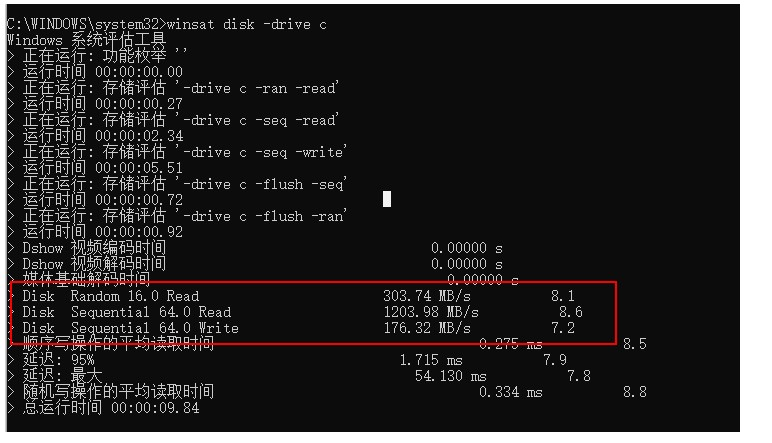

### 日常使用

####  硬盘检测
我们在检测硬盘分区读写性能的时候，可以使用win10 自带的测试命令来测试。此硬盘的最大读写性能！

     在左下角搜索框输入“cmd”，并点击“以管理员身份运行”。
    输入命令“winsat disk -drive 盘符”，并点击“回车”。例如

 winsat disk -drive  c

红色框结果为：

从上到下，分别是：
* 随机读取速度:  303MB/s  
* 顺序读取速度: 1203MB/s
*  顺序写入速度:  176MB/s





### Windows 操作相关

#### 1.Windows下如何查看某个端口被谁占用
``` shell
例如：
netstat -aon|findstr "8081"
tasklist|findstr "9088"  查询运行pid 的详细信息
```
#### 2. 遍历文件目录，输出文件名称
``` shell
@echo off
setlocal

:: 设置目录路径和输出文件名
set "source_directory=D:\123"
set "output_file=D:\123\output.xls"

:: 删除旧的输出文件（如果存在）
if exist "%output_file%" del "%output_file%"

:: 创建输出文件并添加表头
echo Filename > "%output_file%"

:: 遍历目录并将文件名写入输出文件
for %%F in ("%source_directory%\*.*") do (
    echo %%~nxF >> "%output_file%"
)

echo Done!
pause

```

#### 3. 获取指定目录内文件的名称，并且将其增加指定的字符
```
@echo off
setlocal enabledelayedexpansion

:: 设置目录路径
set "source_directory=D:\123"

:: 遍历目录并将文件名写入输出文件
for %%F in ("%source_directory%\*.*") do (
:: 获取文件和拓展名称
  set "file_name=%%~nF"
 
:: 寻找文件名中的下划线 "_" 的位置
    for /f "delims=_" %%A in ("!file_name!") do (
        :: 提取下划线前面的内容
        set "prefix=%%A"
        echo  !prefix!
        set "new_name=jn!prefix!_1%%~xF"
        echo  !new_name!
     :: 重命名文件
        ren "%%F" "!new_name!"
    )


)
echo DONE!
pause

```

#### 4.删除指定目录内的文件，将一天前的文件进行自动删除
``` shell
@echo off
setlocal

set "scan_dir=D:\UserData\Desktop\Workdata\test"
set "date_format=yyyy-MM-dd"
set "log_file=C:\path\to\log\file.log"
REM 获取当前日期
for /f "usebackq tokens=1 delims=" %%a in (`powershell -Command "(Get-Date).AddDays(0).ToString('%date_format%')"`) do set "current_date=%%a"
echo 当前日期是：%current_date%
for /f "usebackq tokens=1 delims=" %%a in (`powershell -Command "(Get-Date).AddDays(-1).ToString('%date_format%')"`) do set "one_day_ago=%%a"
echo 一天前的日期是：%one_day_ago%
forfiles /p "%scan_dir%" /s /m * /d -1   /c "cmd /c if @isdir==FALSE del (del @path & echo Deleted: @path >> "%log_file%")

pause


```

#### 获取指定目录内容是否存list中的文件
```
@echo off

:: 设置目录路径
set source_directory=D:\Image\SEIC

set destination_directory=D:\Image\ok
set list_file=D:\Image\file.txt

for /f %%i in (%list_file%) do (
    if exist "%source_directory%\%%i" (
        echo %%i exists in %source_directory%
       
    ) else (
        echo %%i does not exist in %source_directory%
    )
)
echo DONE!
pause

```

#### 5.将list 中指定的文件复制到指定的目录文件
```
@echo off

:: 设置目录路径
set source_directory=D:\Image\SEIC

set destination_directory=D:\Image\ok
set list_file=D:\Image\file.txt

for /f %%i in (%list_file%) do (
    if exist "%source_directory%\%%i" (
        echo %%i exists in %source_directory%
        xcopy "%source_directory%\%%i" "%destination_directory%" /I /Y
    ) else (
        echo %%i does not exist in %source_directory%
    )
)
echo DONE!
pause


```